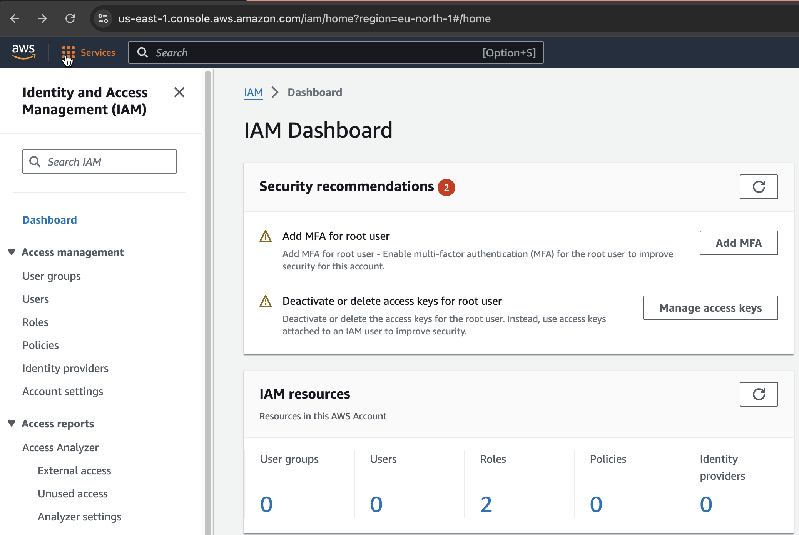
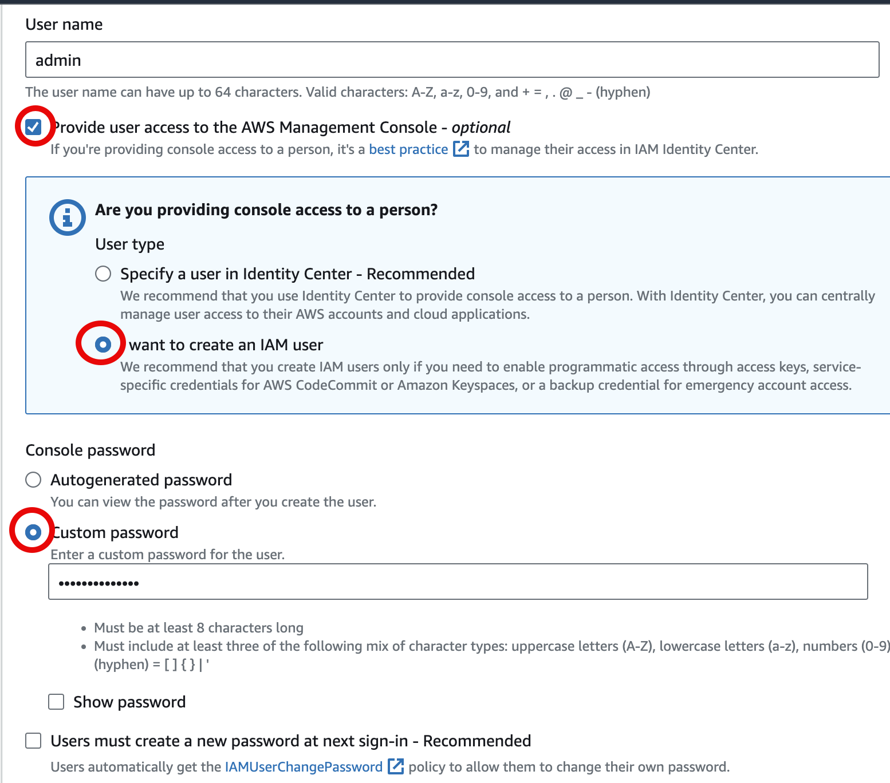
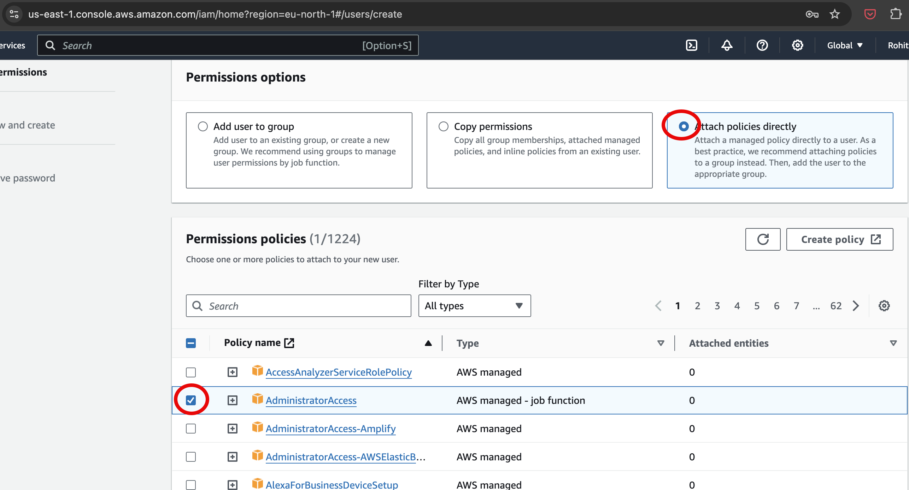
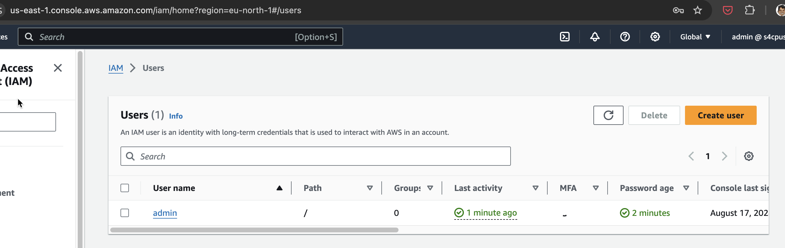

# 0.1 AWS Setup

In this section we'll look into how to setup our AWS account and what is the information needed to move ahead with the course.
Ensure you've read through the [Disclaimer](docs/intro.md#%EF%B8%8F-disclaimer) and [How To Use this Course](docs/intro.md#%EF%B8%8F-how-to-follow-this-course-)

## 🔒 AWS Account Login

- Creating an AWS account using an email whose provider supports Email aliases is strongly recommended.
- Log into your AWS account and visit the IAM Section.



- Click on User and create a user called `admin`



:::tip Why Create a User ?

As a Security best practice, we must not use Root User access for any actions.
[Lock Away Root User](https://docs.aws.amazon.com/IAM/latest/UserGuide/best-practices.html#lock-away-credentials).

:::

- Assign the User `Administrator` privileges as shown below. Click Next. Review and Create User.



## 🔑 AWS Access Keys

- Logout of Root account and login using the `admin` account credentials created. Visit the IAM Page and visit the admin user page as shown below



- Click on the admin user and Click on Create Access Keys


- Select for `CLI (Command Line Interface) and generate the keys


## ✨ Configure AWS Admin Profile

- Let's configure the `admin` account access keys in your local computer. Ensure you have [AWS CLI Installed](https://docs.aws.amazon.com/cli/latest/userguide/getting-started-install.html)

```bash
aws configure --profile admin
AWS Access Key ID [None]: <Enter-Access-key>
AWS Secret Access Key [None]: <Enter-Secret-Access-Key>
Default region name [None]: us-east-1
Default output format [None]: json
```

- Let's check if they are working

```bash
export AWS_PROFILE=admin
aws sts get-caller-identity
```
