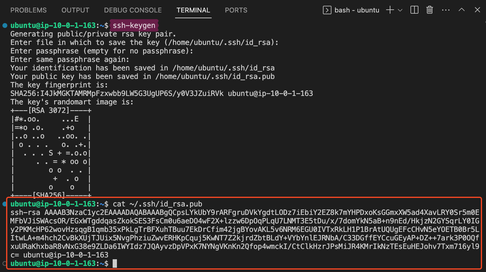
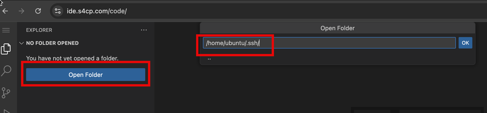
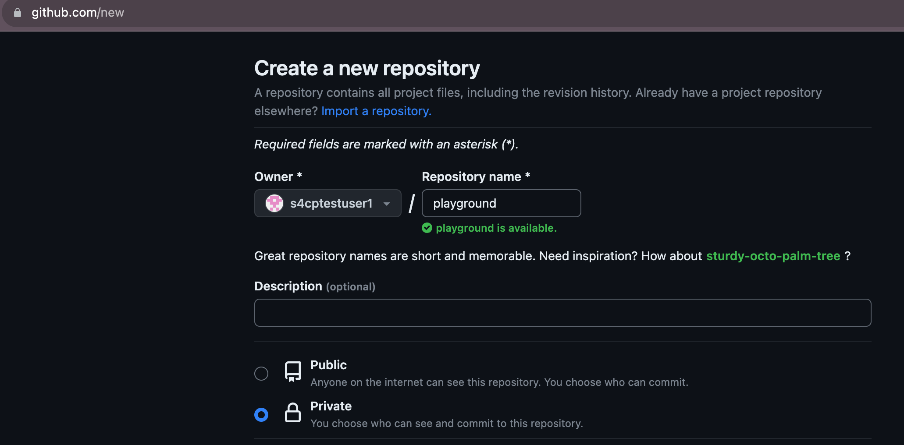

# 🐙 Github Account Setup

We'll be exclusively using Github for CI (Continuous Integration) and Github Actions (Continuous Delivery) throughout this course. Hence, its critical to set things up as required to run this training smoothly.

## 🔑 SSH Key

In this section we'll setup the Github repository and configure Github access which will be used throughout the course.

### 🍔 Configure Github SSH Key <i class="fa fa-flask" aria-hidden="true"></i>

Configure and copy the SSH Key

```bash
cd ~
ssh-keygen
cat ~/.ssh/id_rsa.pub
```



- Open <a href="https://github.com/settings/keys">https://github.com/settings/keys</a> where you signed-in recently.
- Copy the public ssh key in the respective section and click on `Add SSH Key`.


## SSH Config

Its a good idea at this point to also add an ssh config so that we can easily work with github.com through ssh.

1. Create the config file
   
```bash
cd ~
touch ~/.ssh/config
```

2. Open the Config file using the Open Folder command as shown below



3. Add the following lines to your config file and save it.

```config
Host github.com
    HostName github.com
    User git
    IdentityFile ~/.ssh/id_rsa
```

4. Test connectivity to Github

```bash
chmod 600 ~/.ssh/id_rsa
ssh github.com
```

## 🌟 Create a Github Repository

- Create a new repository by visiting the link <a href="https://github.com/new" target="_blank">https://github.com/new</a> and name it as `playgroud`
- Ensure visibility is private.

:::danger Repository Name

For progressing with this course ensure that the name of your repository is `playground` as lot of commands ahead will be based on this name.

:::



That's all your Github setup is good to go 🎉