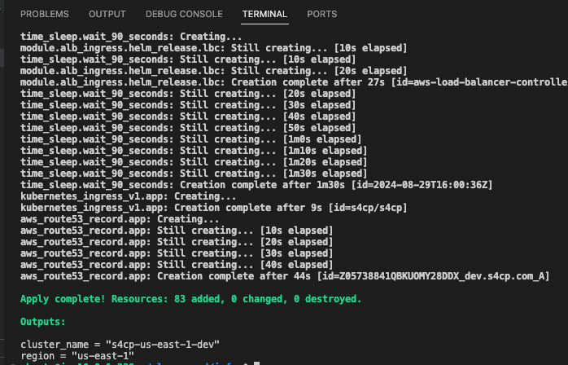
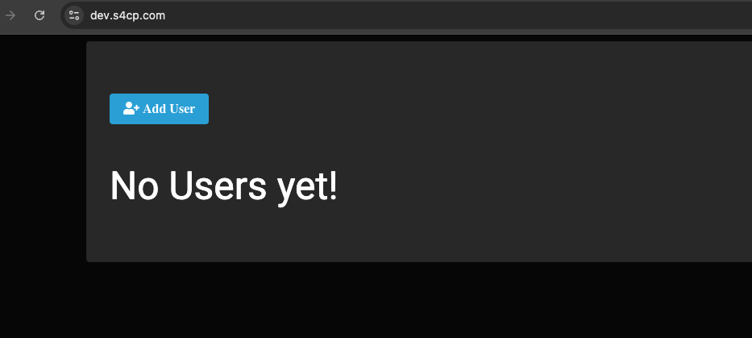
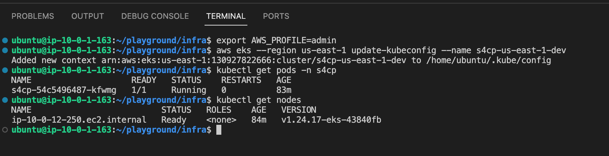

# 1.2 Accessing Application

[Youtube 📺](https://www.youtube.com/watch?v=Am9417a87zU&t=963s)

Once you see the below output, its indicative that your entire stack has been deployed and its time we access it !



## 🌐 Accessing the Web App

- Let's now access the application by browsing to `https://dev.yourdomain.com` as shown below



## ⚓ Accessing Kubernetes

- Now that the app is up and running let's access our k8s cluster using the commands below

```bash
cd ~/playground/infra
export AWS_PROFILE=admin
aws eks --region us-east-1 update-kubeconfig --name s4cp-us-east-1-dev
kubectl get pods -n s4cp
kubectl get nodes
```


