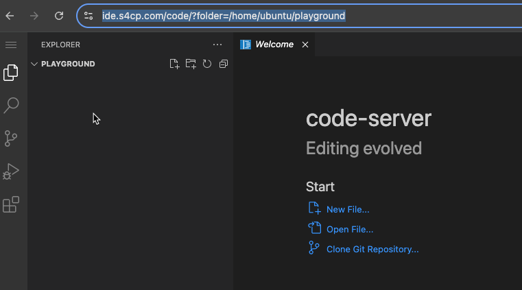
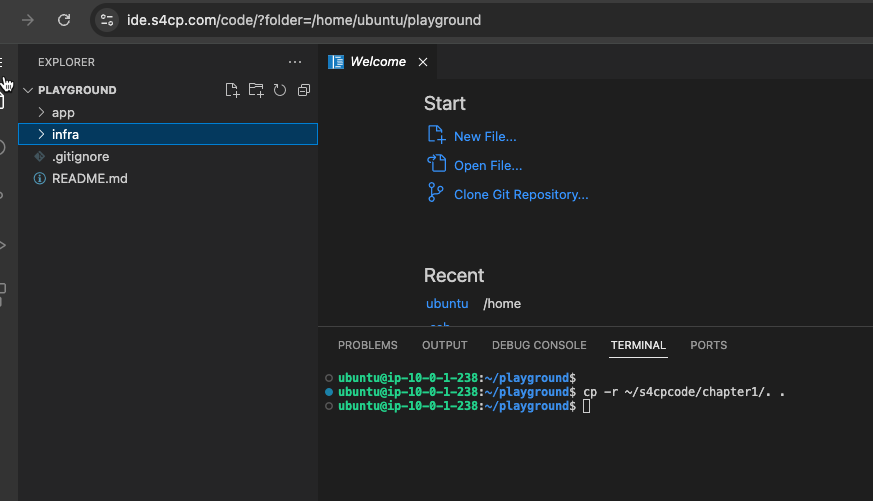
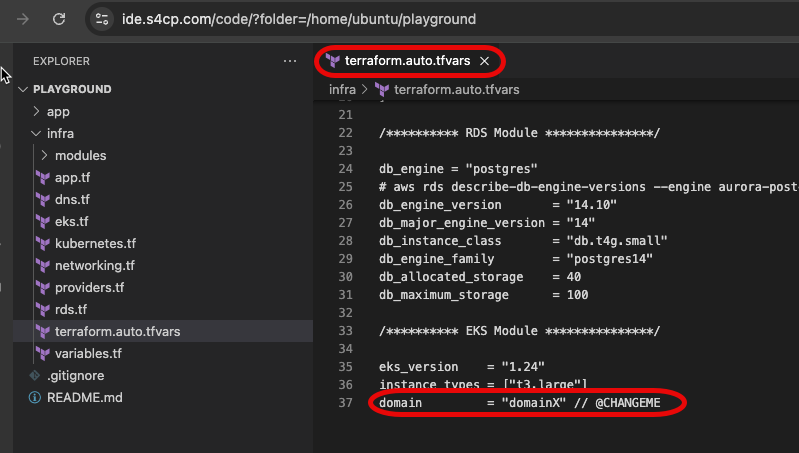
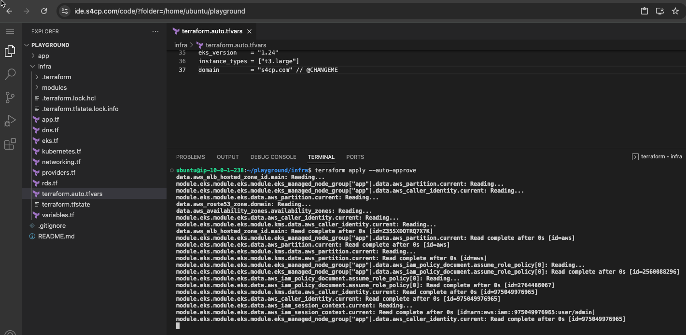

# 1.1 Deploy Stack

The below script will provision the entire AWS infrastructure including AWS EKS,AWS RDS,AWS Route53 and the application deployed as a Kubernetes Deployment along with the necessary ingress controller which is mapped to the hostname provided.

Application doesn't have much functionality at present and all the vulnerable pieces of code are just dead code added on purpose , its not actually being executed.

## 📋 Cloning Code Repository

- Clone the main code repository in the home folder. 

```bash
cd ~
git clone git@github.com:salecharohit/s4cpcode.git
```

:::warning

Please ensure that you clone it in the home folder as the folder names and their location is very important to follow this course and the commands
:::

The repository that you've downloaded is divided into various chapters aligning to the various topics we will be discussing in this course. 

```bash
.
├── README.md
├── chapter1
├── chapter2
├── chapter3
├── chapter4
├── chapter5
└── chapter6
```

## 📁 Creating `playground` 

Open terminal and create a folder called `playground` in the home directory

```bash
cd ~
mkdir playground
```

Open this folder in the UI by clicking on hamburger menu,File -> Open Folder -> `/home/ubuntu/playground` as shown below. Alternatively, you could simply browse to `https://ide.yourdomain.com/code/?folder=/home/ubuntu/playground`



:::info

This is going to be the main folder for all the chapters and contents. As we progress ahead, we'll be updating this folder from the code that is supplied in `s4cpcode` github repository that we downloaded.
:::

## 📋 Copy Chapter 1

- Open the terminal and fire the following commands which will copy the contents of chapter1 from s4cpcode folder into the playground directory.

```bash
cd ~/playground
cp -r ~/s4cpcode/chapter1/. ~/playground/
```



Open `terraform.auto.tfvars` file as shown below and modify the `domain` field with the domain we've setup in [Domain Name Setup](/docs/chapter0-the-setup/domain-setup.md#)



## ⚙️ Configure Admin Profile

- Next, we need the AWS Admin Access keys that were configured to spin up this cloud instance. We need to configure the same here too.

```bash
aws configure --profile admin
AWS Access Key ID [None]: XXXXXXXXXXXXXXXXXXX
AWS Secret Access Key [None]: XXXXXXXXXXXXXXXXXXXXXXXXXXXXXXXXXXXXXX
Default region name [None]: us-east-2
Default output format [None]: json
```

## 🚀 Deploy Terraform Stack

- Once the domain name has been configured in the file, let's execute terraform which will deploy our entire stack using the below commands

```bash
cd ~/playground/infra
export AWS_PROFILE=admin
terraform init
terraform validate
terraform plan
terraform apply --auto-approve
```



:::info

It would take about 15-20 minutes to deploy the entire application so you may want to get some coffee/tea ☕ 
Continue to next page after you finish you coffee/tea.
:::

