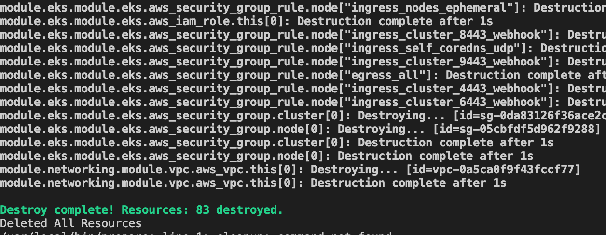

# 1.4 Destroy Stack

Let's destroy this insecure app as we'll now build security ground up

## 🪓 Terraform Destroy

- In the terminal fire the below commands

```bash
cd ~/playground/infra
export AWS_PROFILE=admin
terraform destroy --auto-approve
```



## ❌ Deleting Chapter 1

- Its extremely important that we get rid of all the files in the `playground` as we'll be bootstrapping security from ground up

```bash
cd ~
find ~/playground -mindepth 1 -delete
```

:::note End of Chapter 1

That completes the Chapter 1, before you move to Chapter 2

- Ensure that you've understood the [threats](/docs/chapter1-insecure-code/threat-model.md) the currently exist in your 4 C's i.e. Code,Container,Cluster and Cloud.
- Ensure that your entire infrastructure was properly [destroyed](/docs/chapter1-insecure-code/destroy-stack.md#-terraform-destroy).
- Ensure that your `playground` folder is empty and that you've followed above step to [delete](/docs/chapter1-insecure-code/destroy-stack.md#-deleting-chapter-1). the contents.

:::