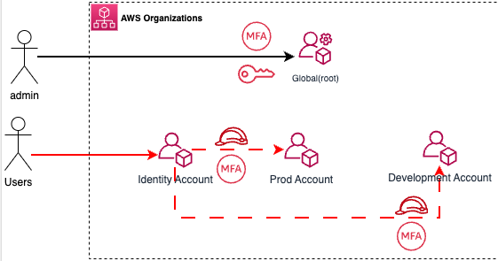
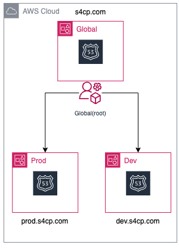

# 2.3.1 About AWS IAM Roles & Groups

[Youtube 📺](https://www.youtube.com/watch?v=Am9417a87zU&t=1696s)

In the previous section we created Multiple different accounts let's now understand what are the different IAM Resources that will be created in this section to manage authorized access into our AWS infrastructure.

## 🔐 Identity Account

- Following resources are created in the identity account.
  - **SelfManage:** All users are by default added into a self-manage group where they can only login into the console and CLI. They cannot perform any other action unless they assume a role that will be created in this section as described below.
  - **AssumeRoleIAMAdminWithMFA:** IAM Role to perform IAM related activities from the IAM Console of the identity account.

:::tip AWS Access Key Generation

All non-admin users created in the identity account will **NOT** have the ability to **generate their own access keys.** The same needs to be requested via code which we'll see in the later section.
:::

## 🚀 Prod Account

- Following IAM roles will be created in the prod account and only certain users will be allowed to assume this role.
  - **AssumeRoleAdminWithMFAprod** : Admin role for Human users accessible only through an MFA Authentication
  - **AssumeRoleDeveloperWithMFAprod** : Limited Privilege developer role into Prod resources accessible only through MFA Authentication

## 🛠️ Dev Account

- Following IAM roles will be created in the dev account and only certain users will be allowed to assume this role.
  - **AssumeRoleAdminWithMFAdev** : Admin role for Human users accessible only through an MFA Authentication

## 👥 AWS IAM Resources

Following table and the corresponding diagram summaries the AWS IAM Resources(Roles and Groups) that is being created in each account.

| Name                           | Type       | Account  | Permissions                   |
|--------------------------------|------------|----------|-------------------------------|
| AssumeRoleAdminWithMFAprod     | IAM Role   | prod     |Admin                          |
| AssumeRoleDeveloperWithMFAprod | IAM Role   | prod     |Limited ReadOnly               |
| AssumeRoleAdminWithMFAdev      | IAM Role   | dev      |Admin                          |
| AssumeRoleIAMAdminWithMFA      | IAM Role   | identity |iam:*                          |
| SelfManage                     | IAM Group  | identity |change password,MFA            |

:::tip
For the purpose of this training we are using Admin privileges however, you can configure the permissions as per your needs.
<a href="https://github.com/iann0036/iamlive" target="_blank">https://github.com/iann0036/iamlive</a> is a good tool to help you evaluate what kind of privileges are needed for your environment.
:::

## 👥 Route53 Zones

- In addition to the AWS IAM Roles, we'll also be creating Route53 zones in each of the prod and dev accounts created earlier as shown below
  - s4cp.com already created earlier in Global
  - prod.s4cp.com created for Prod resources
  - dev.s4cp.com created for Dev resources

Hence, our application can now go live with dev.s4cp.com and prod.s4cp.com hostnames in their respective environments. Also, this time the NS donot need to be added as the Terraform code will automatically add them the Route53 zone of the Global account.