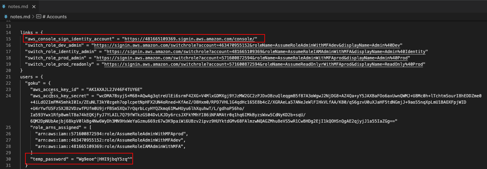
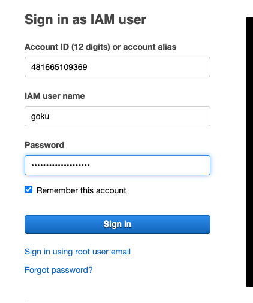
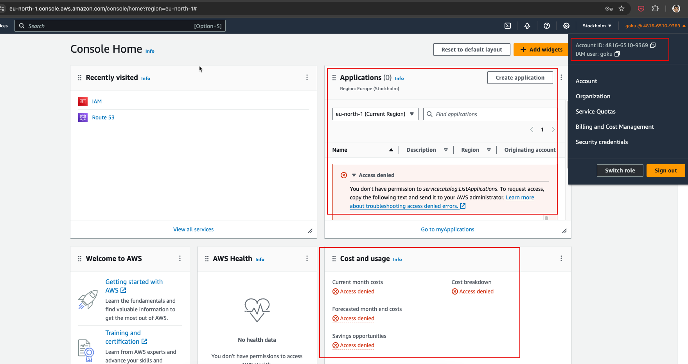
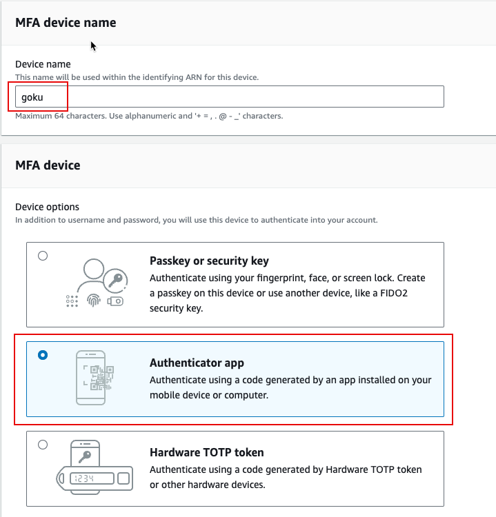
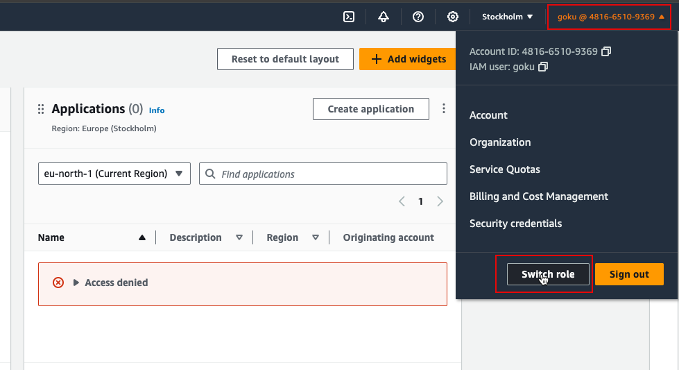
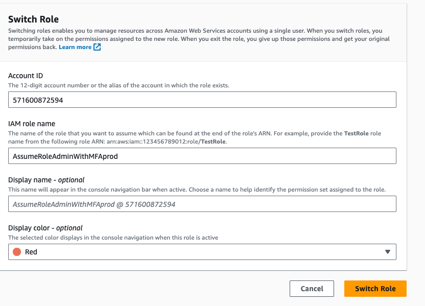
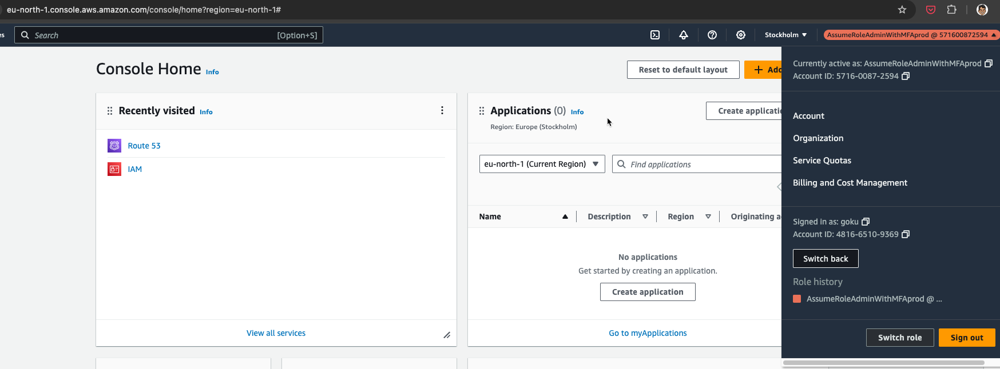
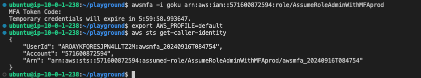

# 2.4.5 Configuring Goku Access

[Youtube 📺](https://www.youtube.com/watch?v=Am9417a87zU&t=2335s)

In this section we'll configure Goku's Console as well as CLI access by changing the password and configuring MFA

:::warning

Please keep your MFA devices ready !

:::

## 🔓 Identity Account Access

- Open the identity account URL from the terraform output that was saved in notes.md file as shown below.



- Login using the temporary credential for Goku.



### 🔑 Change Password

- Once you access the console using the temporary password you'll be forced to change the password. Ensure you note it down or save it in a secure manner.

### 🛂 Accessing the Console

- After password change when you log into the console, you'll be greeted with `Access Denied` errors because at present, the default permissions attached are that of the `Self-Manage` group which allows only password change and MFA configuration.
 
- 

## 📱 Configure MFA

- Configure MFA as shown below keeping the name of the MFA same as that of user to avoid confusion.
- Select Authenticator app as the option for MFA
- Continue with the simple MFA steps as directed on the AWS Console.
[https://console.aws.amazon.com/iamv2/home#/security_credentials/mfa](https://console.aws.amazon.com/iamv2/home#/security_credentials/mfa)

- 

## ⚙️ Configuring Console Access using MFA

- After configuring MFA, logout from the console and login using the identity url as performed earlier.
- This time when you sign-in, AWS will ask for the MFA OTP. Please provide the same using the authenticator application.
- Next, click on the right-corner showing goku-account-number and click `Switch Role`
  


- Next in the switch role screen add the account ID and the IAM Role that Goku has access to. This information has been saved in notes.md file.
- Ex: Accessing Prod account with Administrator Privileges
  
- 

You should now have access to the Prod account AWS Console

- 

## 🖥️ Configuring CLI Access using MFA

- Let's access the same Prod AWS Account from CLI using MFA

```bash
awsmfa -i goku arn:aws:iam::<prod-account-id>:role/AssumeRoleAdminWithMFAprod
prompt> Enter MFA Code
export AWS_PROFILE=default
aws sts get-caller-identity
```




:::tip About awsmfa utility

The `awsmfa` utility is an open-source utility to simplify MFA access using CLI

[https://pypi.org/project/awsmfa/](https://pypi.org/project/awsmfa/)

:::
