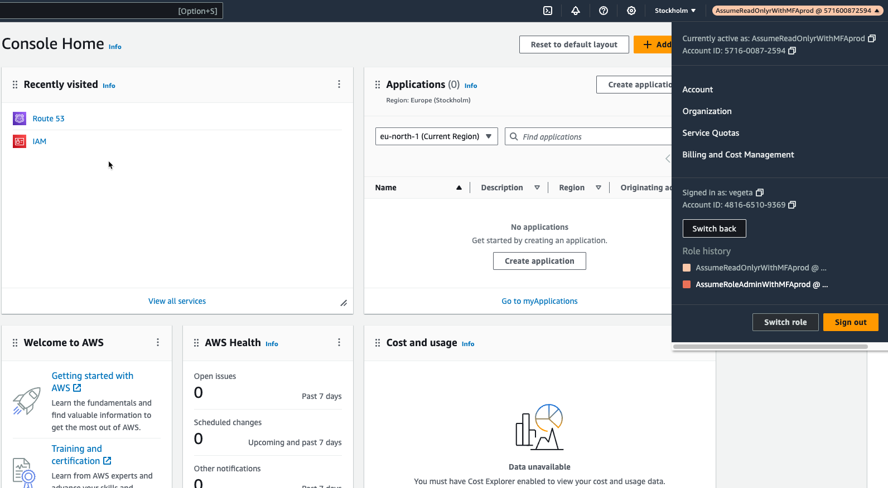
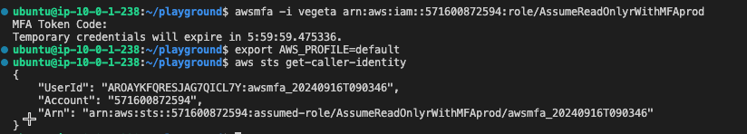

# 2.4.6 Configuring Vegeta Access

In this section we'll configure Vegetas's Console as well as CLI access by changing the password and configuring MFA, on similar lines as done for [Goku](/docs/chapter2-securing-iam/aws_iam_users/configuring_goku_access.md)

## 🔓 Identity Account Access

- Open the identity account URL from the terraform output that was saved in notes.md file as shown below.
- Login using the temporary credential for Vegeta.

### 🔑 Change Password

- Once you access the console using the temporary password you'll be forced to change the password. Ensure you note it down or save it in a secure manner.

## 📱 Configure MFA

- Configure MFA keeping the name of the MFA same as that of user to avoid confusion.
- Select Authenticator app as the option for MFA
- Continue with the simple MFA steps as directed on the AWS Console.
[https://console.aws.amazon.com/iamv2/home#/security_credentials/mfa](https://console.aws.amazon.com/iamv2/home#/security_credentials/mfa)

## ⚙️ Configuring Console Access using MFA

- After configuring MFA, logout from the console and login using the identity url as performed earlier.
- This time when you sign-in, AWS will ask for the MFA OTP. Please provide the same using the authenticator application.
- Next, click on the right-corner showing vegeta-account-number and click `Switch Role`
- Next in the switch role screen add the account ID and the IAM Role that Vegeta has access to. This information has been saved in notes.md file.
- Ex: Accessing Prod account with ReadOnly Privileges
  


## 🖥️ Configuring CLI Access using MFA

- Let's access the same Prod AWS Account from CLI using MFA

```bash
awsmfa -i vegeta arn:aws:iam::<prod-account-id>:role/AssumeReadOnlyrWithMFAprod
prompt> Enter MFA Code
export AWS_PROFILE=default
aws sts get-caller-identity
```

- 