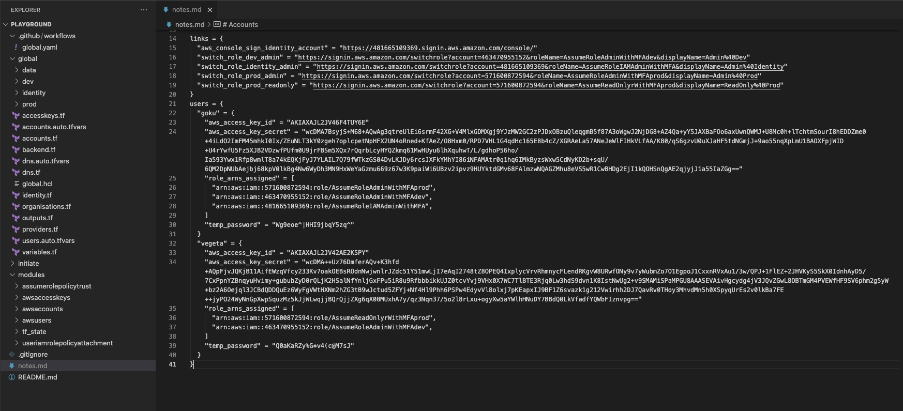

# 2.4.3 Creating IAM Users

Now that we have all the needed resources in code, let's push the code,create the resources and note down the output.

## Pushing the Changes for AWS IAM Users

Let's now push the changes and provision the new AWS Users

```bash
cd ~/playground/
git status
git add .
git commit -m 'adding IAM Users'
git push
```

## View Terraform Output

- Visit Github Actions for the `global.yaml` workflow


## Copy Terraform Output

- Record the output of above Terraform execution and paste it into notes.md file as shown below



