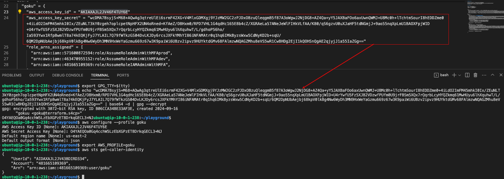
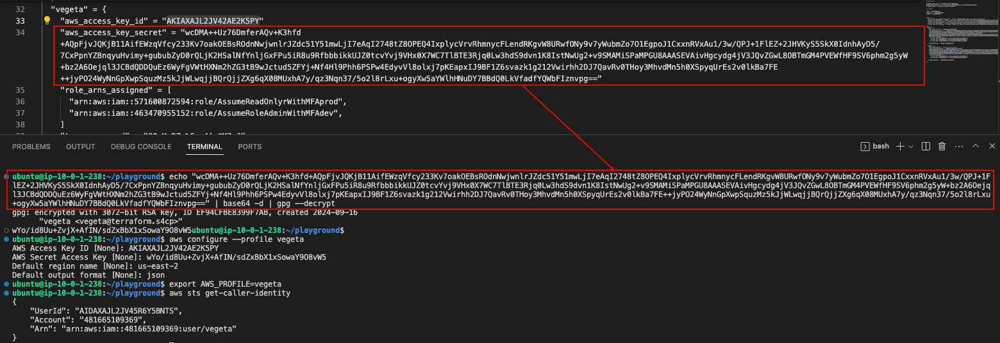

# 2.4.4 Decrypting GPG Keys

[Youtube 📺](https://www.youtube.com/watch?v=Am9417a87zU&t=2185s)

In this section we'll perform the most critical task of extracting the AWS Access Keys and accessing the AWS Accounts through CLI.

## 🔧 Extracting AWS Keys for Goku

Now that the Goku's keys have been generated let's decrypt them,configure and check if its working.

```bash
export GPG_TTY=$(tty)
echo "<aws_access_key_secret string from terraform output of Goku>" | base64 -d | gpg --decrypt
aws configure --profile goku
export AWS_PROFILE=goku
aws sts get-caller-identity
```



## 🔧 Extracting AWS Keys for Vegeta

Similarly let's decrypt Vegeta's keys,configure and check if its working.

```bash
export GPG_TTY=$(tty)
echo "<aws_access_key_secret string from terraform output of Vegeta>" | base64 -d | gpg --decrypt
aws configure --profile vegeta
export AWS_PROFILE=vegeta
aws sts get-caller-identity
```



:::tip GPG Keys Extraction

The encrypted AWS Secret Access Key will be decypted only on the machine where the private key is stored.

:::

:::warning AWS Secret Access Keys

The AWS Secret Access Keys shown here are purposely not hidden as it might become a hindrance for someone to follow the command properly. Hence, by the time this training is live, all resources related to this AWS Account would have already been deleted.
:::