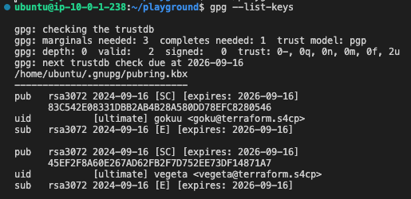
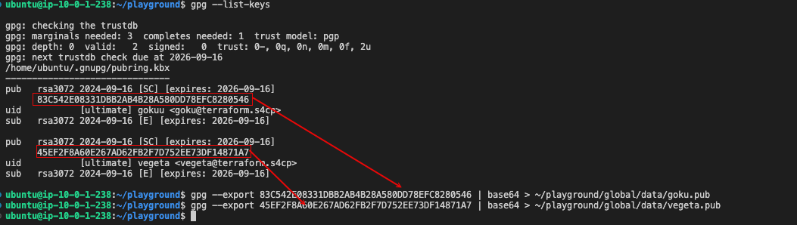

# 2.4.2 Generating GPG Keys

[Youtube 📺](https://www.youtube.com/watch?v=Am9417a87zU&t=1948s)

As stated earlier, we'll be allowing users to setup their AWS Access keys only through Terraform. However, the Access Key ID and Access Key Secret must not be stored in clear-text in our Terraform state file and also cannot be shared with the user in clear-text format.

For that purpose, terraform allows us to share a public GPG key using which the AWS Secret Access Key is encrypted using the public GPG key. The base64 encoded and GPG encrypted key is then shared with the user, who is the only one who can decrypt the encrypted string and obtain the key.

Hence, the user must first share their public key and through the below steps we are generating the GPG key pair containing both the public and private key. Ideally this step must be performed by each user on their respective machines and keep the private key safe.

## 🛠️ Preparing the Code

Preparing the code for creating AWS IAM Users.

```bash
cd ~/playground
cp -r ~/s4cpcode/chapter2/2D/. ~/playground/
```

:::warning GPG Username and Email

For purpose of this training the username I am using is `gokuu` (GPG Expects atleast 5 characters in username) and `vegeta` and their respective imaginary email addresses `goku@terraform.s4cp` and `vegeta@terraform.s4cp` 
You are free to follow your own naming convention and real email addresses provided you replace the same across the code and instructions, else you'll get errors.

May the KamehaaaaMehaaaaa be with you

👐 🔥🔥🔥🔥🔥🔥🔥🔥🔥🔥🔥🔥
:::

## 🔑 Generating GPG Keys for Goku

```bash
gpg --generate-key
prompt> Real name: gokuu
prompt> Email address: goku@terraform.s4cp
prompt> Change (N)ame, (E)mail, or (O)kay/(Q)uit?: O
prompt> Enter passphrase
prompt> Re-enter passphrase
```

## 🔑 Generating GPG Keys for Vegeta

```bash
gpg --generate-key
prompt> Real name: vegeta
prompt> Email address: vegeta@terraform.s4cp
prompt> Change (N)ame, (E)mail, or (O)kay/(Q)uit?: O
prompt> Enter passphrase
prompt> Re-enter passphrase
```

## 📋 Copying the Public GPG Key of Terraform

After generating the GPG key pair, consisting of a public and private key, the private key is securely stored on the system. The next step is to share the public key with Terraform. Terraform will use this public key to encrypt the AWS secret keys. Once encrypted, Terraform will include the encrypted keys in its output. In later steps, the corresponding private key will be used to decrypt the AWS secret keys for further use. This process ensures secure handling of sensitive AWS credentials.

```bash
cd ~/playground
gpg --list-keys
```



```bash
gpg --export <publikc-key-id> | base64 > ~/playground/global/data/goku.pub
gpg --export <publikc-key-id> | base64 > ~/playground/global/data/vegeta.pub
```



:::tip GPG Key Generation and Sharing

- In practice each individual user shall be responsible in extracting their own keys.
- We are doing this as part of the training because we have all the GPG keys configured in the same machine.
- Practically each user will share their public keys and the encrypted output shall be granted to them for decryption maintaining the confidentiality of the data.

:::

:::warning AWS Key Leakage

In an event where the Terraform AWS key is compromised and needs to be changed, this GPG key needs to be regenerated and republished with Terraform.
Terraform will then utilize the refreshed GPG keys to generate a new set of AWS Keys.

:::
