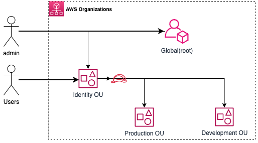

# 2.2.1 About AWS Organisations

[Youtube 📺](https://www.youtube.com/watch?v=Am9417a87zU&t=1365s)

AWS Organizations is a service provided by Amazon Web Services (AWS) that helps you manage multiple AWS accounts within your organization.

- Account Management: Centralized management of multiple AWS accounts.
- Cost Control: Consolidated billing for easier cost allocation and tracking.
- Access Control: Policy-based control over permissions and access.
- Resource Sharing: Share resources across accounts.
- Service Control Policies (SCPs): Fine-grained permissions at the organizational level.
- Scalability: Easily add or remove accounts as needed.

Below is a glimpse of all the AWS Accounts that we'll be setting up

## 🗂️ S4CP Multi-Account Architecture

In this training we are looking at creating multiple accounts like identity,dev and prod in order to reap the benefits of AWS Organisations as discussed above.

### 🌐 Global(root) Account

- This is the root account that is where we are currently operating from. This is already created and we will be using this account to create the AWS Organisation.
- For the purpose of this training, I am calling this as the `global` account.
- This account will hold all global infrastructure and following are the resources that we've already created
  - S3 Bucket and DynamodDB for storing terraform state for all resources
  - Github OIDC IAM Role to allow Github Actions to assume into our AWS account to set things up
  - Route53 Zone configuration for deploying our application DNS
  
### 🔐 Identity

- This is a central account or the landing account for all AWS Users.
- All AWS Users(Human as well as Service) will need to configure an MFA device and then assume certain roles in order to access Dev and Prod accounts.
- Users will be created in this account only no other accounts shall have Users being created.

### 🚀 Production

- This account is for setting up the Production infrastructure
- It will have the necessary IAM Roles created for maintaining authorised access.

### 🚧 Development

- This account is for setting up the Dev/Testing infrastructure
- It will have the necessary IAM Roles created for maintaining authorised access.
