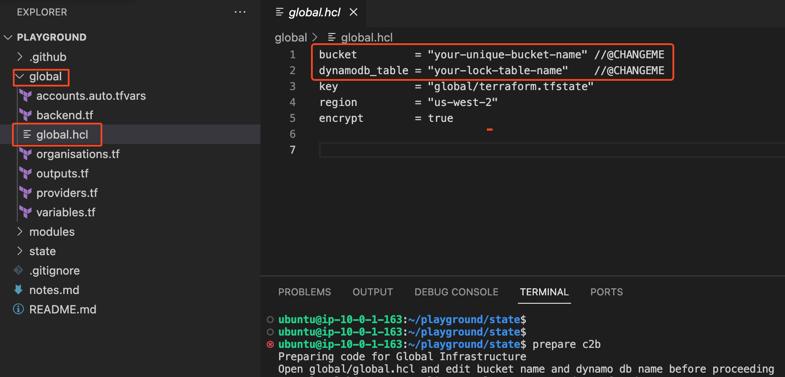
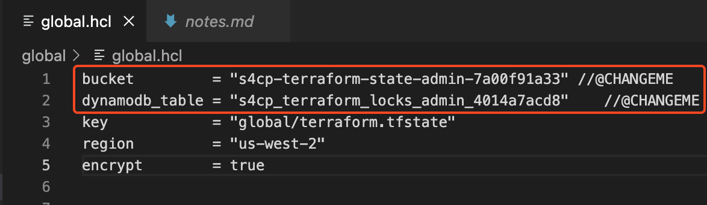
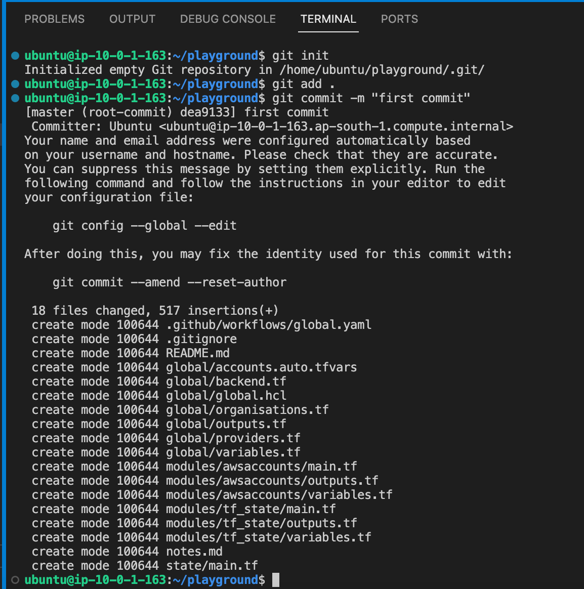
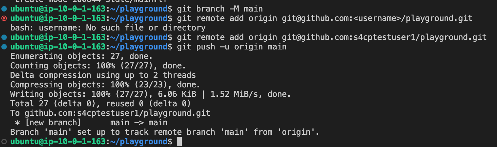

# 2.2.2 Setting Up AWS Organisations

In this section we'll activate our AWS Organization and create the required identity,prod and development 

## ⚙️ Setup AWS Organizations

Let's go ahead and setup our AWS Organization. Below command will setup the code that will setup the Root,Prod,Dev and Identity accounts.

```bash
cd ~/playground
cp -r ~/s4cpcode/chapter2/2B/. .
```

## ✏️ Edit global.hcl

- Open `global/global.hcl`



- Edit bucket name and dynamo db name that can be copied from notes.md saved earlier.



## Configure IAM Role

- Next, we also need to configure the `AWS_OIDC_GLOBAL_ADMIN` using which GHA will have temporary access to the AWS account.
- Open `https://github.com/<username>/playground/settings/variables/actions`


- Click on `New Repository Variable` and add `AWS_OIDC_GLOBAL_ADMIN` as the key and the value as copied in the notes.md file. Save it.
  
  


## ✔️ Commit The changes

```bash
git init
git branch -m main
git add .
git config --global user.name <username>
git config --global user.email <email>
git commit -m "first commit"
```



## ⬆️ Push The changes

```bash
git remote add origin git@github.com:<username>/playground.git
git push -u origin main
```


