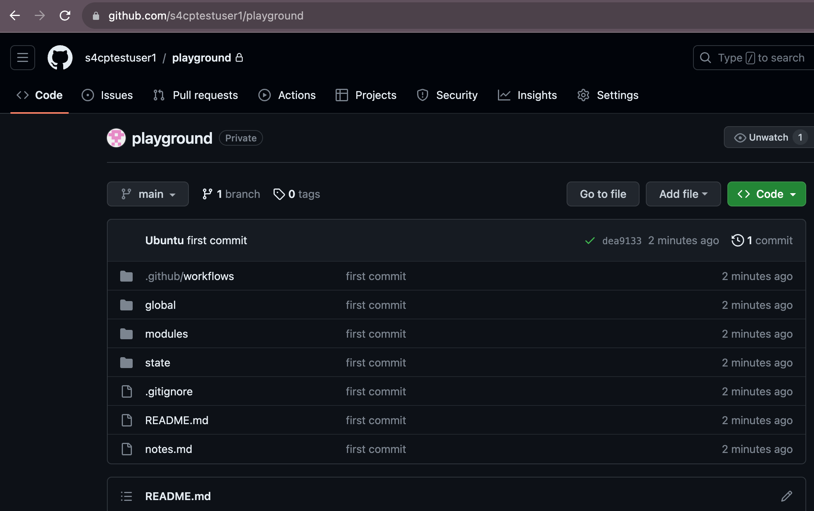
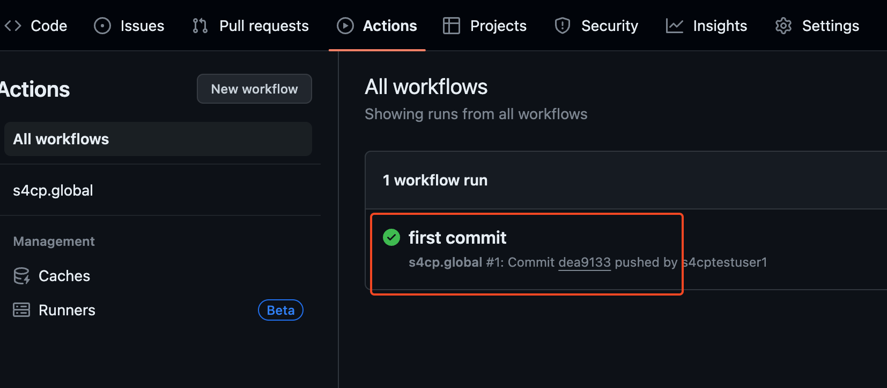
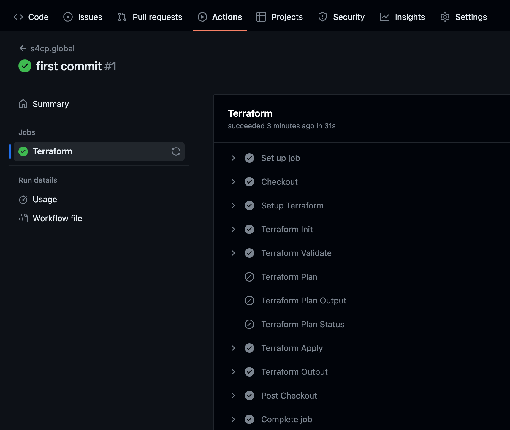
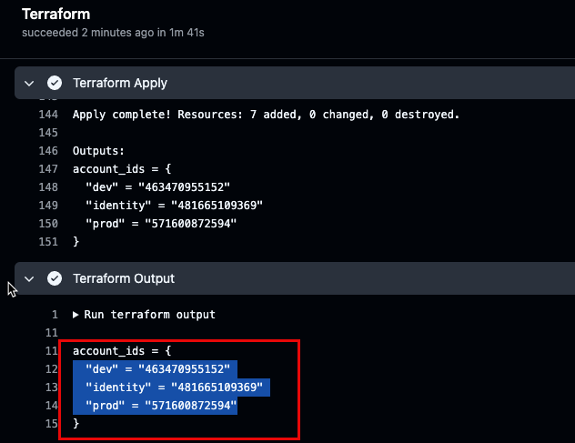
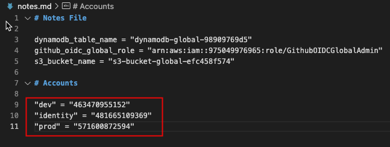

# 2.2.3 Viewing AWS Accounts

[Youtube 📺](https://www.youtube.com/watch?v=Am9417a87zU&t=1622s)

In this section we need to now view the AWS Accounts and update the account IDs in notes.md file

## ✅ View and Verify the changes

- Verify code has been committed on Github.

## ▶️ View Github Actions

- Navigate to Github Actions Tab of the repository to view our GHA has been executed

## 🖥️ View Terraform Output

- View Terraform Output 

## 📋 Copy Information in notes.md

- Copy the Terraform Output to notes.md file as we'll be needing this information more often.

