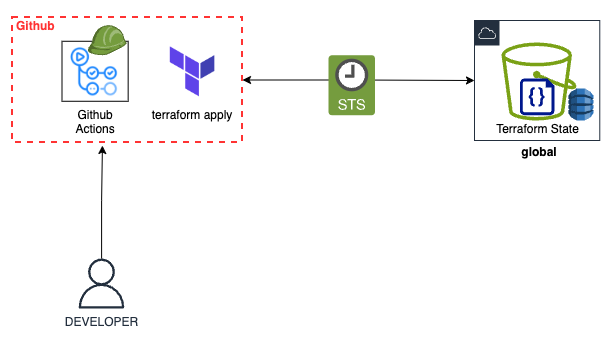

# 2.1.2 OIDC

[Youtube 📺](https://www.youtube.com/watch?v=Am9417a87zU&t=1117s)

**OpenID Connect (OIDC)** is an identity layer built on top of the OAuth 2.0 protocol that allows clients, like applications, to verify the identity of end-users based on the authentication performed by an external provider. In AWS, an OIDC provider lets AWS services trust an external identity provider, such as GitHub, to authenticate and authorize access to AWS resources without needing to manage long-term credentials.

When you create an OIDC provider in AWS and configure it with GitHub Actions, AWS trusts GitHub’s identity tokens issued during workflows. This setup allows GitHub Actions to assume a specific AWS IAM role with permissions to access AWS resources, instead of relying on static, long-term access keys embedded in workflows. As a result, access is granted dynamically, only during the execution of a workflow, significantly reducing the risk of exposing permanent credentials.

This approach enhances security by eliminating the need for hardcoded AWS access keys in GitHub repositories, which could be leaked or misused if compromised. Instead, short-lived credentials are generated on-demand, tightly scoped, and automatically revoked when the workflow ends, ensuring a more secure and manageable integration between GitHub Actions and AWS.

In the AWS IAM Role's trust relationship, we need to add specific Github Repository(ies) which are allowed to obtain temporary access keys when executed through Github Actions in that repository.

:::tip Long-Live Admin Access Keys

With this, we can eliminate the requirement for storing long-lived access being embedded in Github Actions or other systems.
:::
