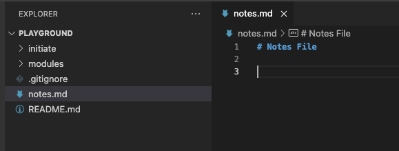
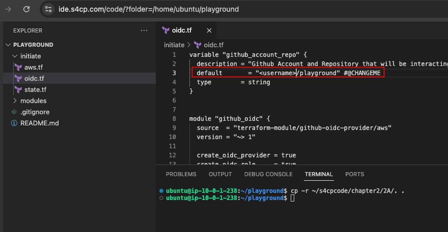
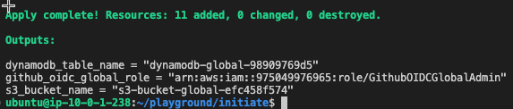
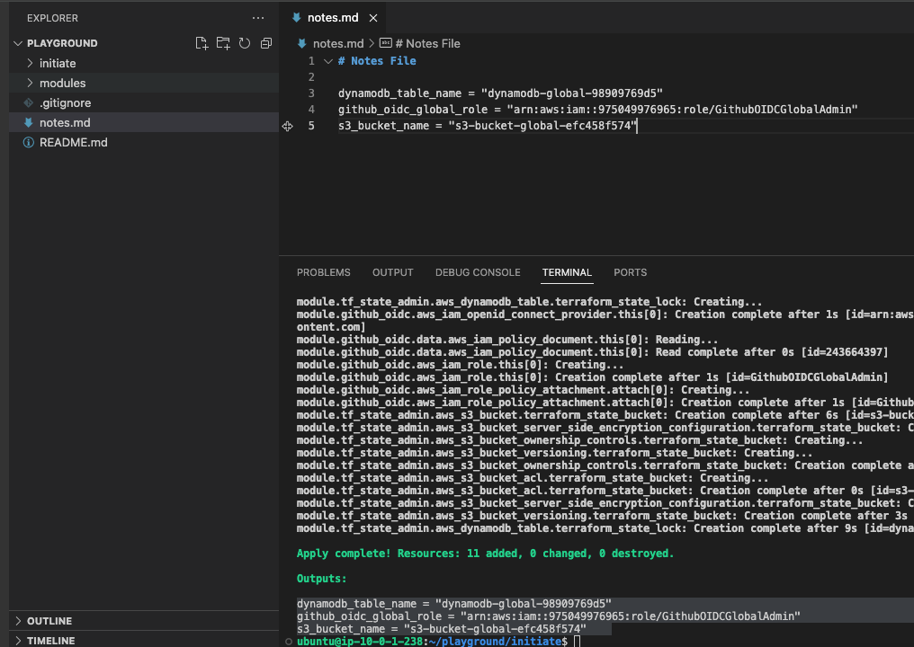
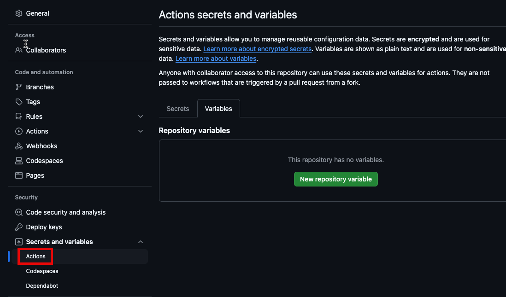
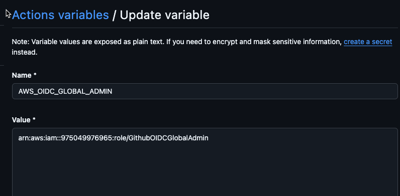

# 2.1.3 Run Code

[Youtube 📺](https://www.youtube.com/watch?v=Am9417a87zU&t=1122s)

Now that we've understood what is [Terraform State](/docs/chapter2-securing-iam/initiate/about_terraform_state.md) and [OIDC](/docs/chapter2-securing-iam/initiate/about_oidc.md) let's being by creating these items alongwith the necessary items of S3 Bucket and DynamoDB

## 📜 Create Notes.md

- Throughout this course we'll be requiring a scratchpad to save various information from different sections/chapters like account IDs,S3 bucket Names,IAM Role ARNs etc ... which will serve as an input for later sections/chapters.
- Hence, its imperative that we create a file in the root of `playground` as shown below



:::tip .gitignore

Donot worry, and save as much information as possible in notes.md file as it is added in .gitignore so nothing's getting committed to your remote repo
:::

## 🗄️ Creating S3,DDB and OIDC

Below command will prepare the code for setting up the S3 and DynamoDB backend that'll be used to store the Terraform state file for the global environment.

- Let's copy the code from s4cpcode folder for setting up our Terraform state.

```bash
cd ~/playground
cp -r ~/s4cpcode/chapter2/2A/. ~/playground/
```

- We need to edit the file `playground/initiate/oidc.tf` and edit replace `<username>` with your action Github username.



- The code that we've just copied will basically create the following in our `global` (more on why its called global in later chapters) AWS account.
  - An S3 Bucket with versioning enabled
  - A DynamoDB for storing the state lock
  - An OIDC Provider for Github Actions to authenticate into AWS from a specific repository which we just added above.

Lets's create'em by following the commands below

```bash
cd ~/playground/initiate
export AWS_PROFILE=admin
terraform init 
terraform validate
terraform plan 
terraform apply --auto-approve
```

Expected Output.



## 📋 Copy Output to Notes.md

Please copy the output and paste it in notes.md file as shown below.



## ⚙️ Configure OIDC IAM Role

- Next, we also need to configure the `AWS_OIDC_GLOBAL_ADMIN` using which GHA will have temporary access to the AWS account.
- Open `https://github.com/<username>/playground/settings/variables/actions`



- Click on `New Repository Variable` and add `AWS_OIDC_GLOBAL_ADMIN` as the key and the value as copied in the notes.md file. Save it.
  
  


:::note End of Chapter 2 - Initiate

- In this chapter we learnt about [terraform state](/docs/chapter2-securing-iam/initiate/about_terraform_state.md) and even created it for storing all the changes that will happen to our infrastructure
- We also learnt about [Open ID Connect](/docs/chapter2-securing-iam/initiate/about_oidc.md) and how it can help in creating temporary AWS tokens that are short-lived and donot require any storage. We also created an OIDC provider in our root AWS account.
:::