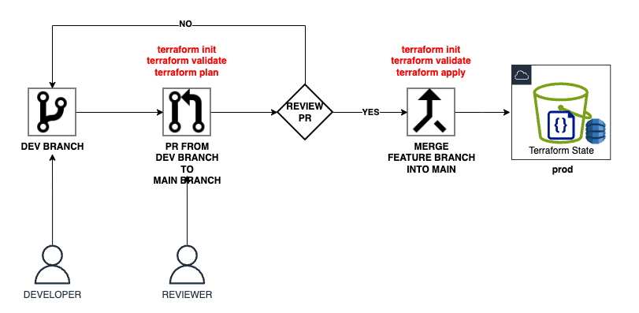

# 2.5.1 Multi-Environment Strategy

We have so far created one identity account and two operational accounts viz. prod and dev where we'll deploy all the AWS resources.
We need this multi-environment strategy so that we can verify our changes in the dev environment before pushing into the prod.
This shall follow a specific pattern as described below

1. Developer makes changes in the code for dev account.
2. Creates a dev branch and pushes changes in the dev branch.
3. Dev branch has details of only dev environment which then provisions the dev infrastructure
4. Once dev infra changes are verified, a PR is raised.
5. PR is verified and merged.
6. Upon merge changes are pushed to main branch which is tied to Prod environment which then goes live. 

