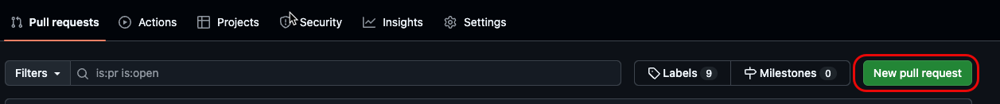
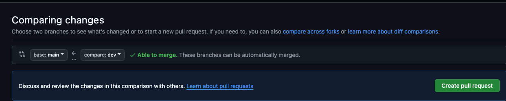
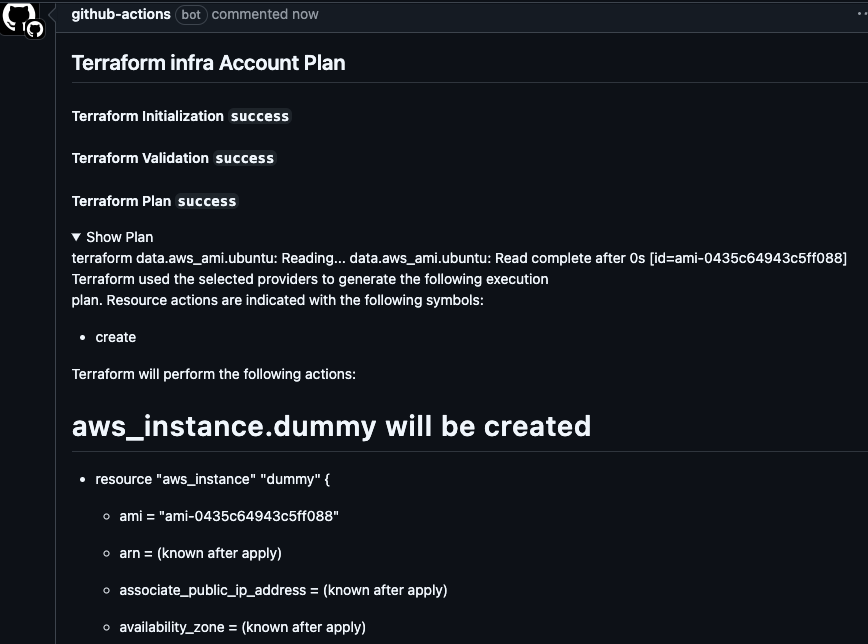
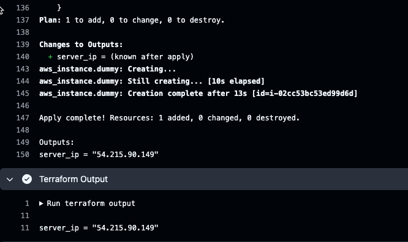

# 2.5.4 Prod Environment

Now that we are sure that our code works in `dev` its time to push our changes in `prod` environment.

## 🔄 Create PR dev to prod

- Let's visit github.com and now Create a New Pull Request

- Let's create a new PR and select `base:main` and `compare:dev` as shown below and `Create Pull Request`

- The PR will show the expected terraform changes in comments as shown below 

## 🔀 Merging PR

- Let's now merge the Pull Request, which will activate the dev workflow to create an EC2 instance in the `prod` environment. Click on `Merge Pull Request` and then `Confirm Merge`.

- Visit Github Actions and view that the Terraform Apply will be executed and an EC2 instance will be created in the `prod` environment as shown below

This completes the entire workflow from `feature1` -> `dev` -> `prod` 
