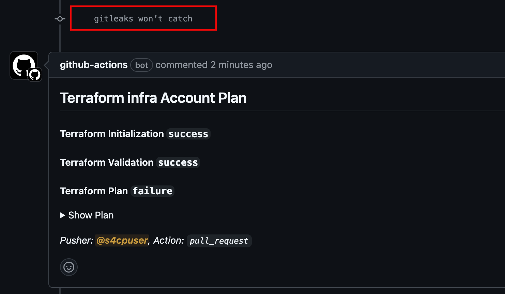
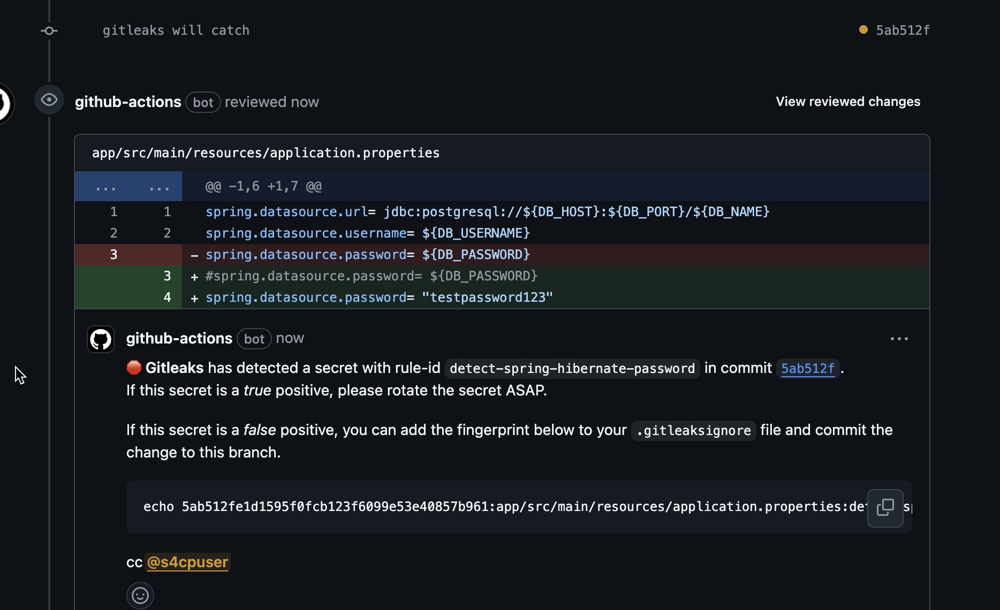

# Customizing Gitleaks

Uptil now we've been using the default config that comes along with Gitleaks of all the regexes that help identify secrets. Here is the link of the [default config](https://github.com/gitleaks/gitleaks/blob/master/config/gitleaks.toml)

## 🚫 Gitleaks won't catch

The command below pushes a custom secret that gitleaks will not catch in the `application.properties` file

```bash
cd ~/playground/
cp -r ~/s4cpcode/chapter3/3DDD/. ~/playground/
git status
git add .
git commit -m "gitleaks won’t catch"
git push --set-upstream origin gitleaks
```

## 🔍 View PR !

Let's View the Terraform Github Actions and check if gitleaks is catching this secret.

- As can be seen from the screenshot below gitleaks is still unable to catch the secret in `application.properties` file.



## 🎣 Gitleaks catches !

We shall now add a custom configuration in `gitleaks.toml` and also activate the custom configuration by renaming it to `.gitleaks.toml` using the command below.

```bash
cd ~/playground/
mv gitleaks.toml .gitleaks.toml
sed -i'.bak' 's/testpassword/testpassword123/g' app/src/main/resources/application.properties
rm app/src/main/resources/application.properties.bak
git status
git add .
git commit -m "gitleaks will catch"
git push --set-upstream origin gitleaks
```

The configuration that has been added is as shown below

```toml
[[rules]]
description = "This Rule will detect Hibernate Passwords stored in properties file"
id = "detect-spring-hibernate-password"
regex = "spring\\.datasource\\.password\\s*=\\s*\"([^\\\"]+)\""
keywords = [
    "spring",
    "boot",
    "hibernate"
]
```

## 👁️ View PR

As can be seen now Gitleaks caught our new secret as configured by our custom rule.


