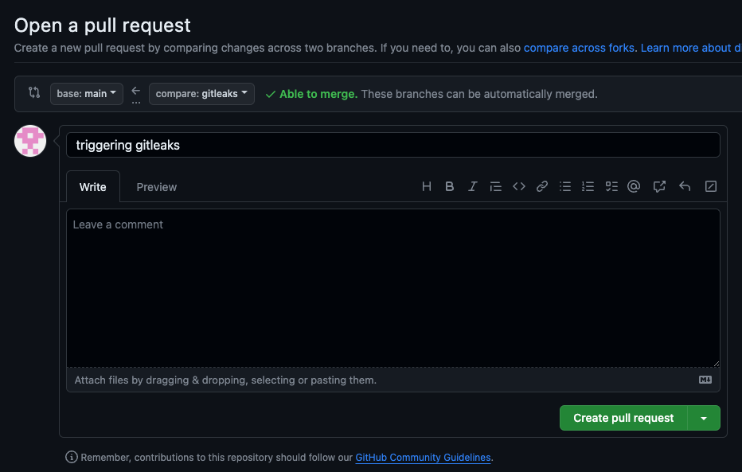
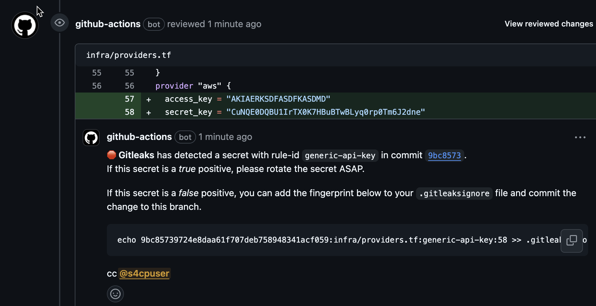

# 3.3.2 Integrating Gitleaks with GHA

[Youtube 📺](https://www.youtube.com/watch?v=Am9417a87zU&t=4204s)

In this section let's explore how can we practically integrate Gitleaks with Github Actions utilising both the scenarios discussed earlier.

## ✅ Prepare the Code

The below command shall prepare the code for integrating gitleaks github action in all the workflow files created till now and also add `gitleaks.yaml` workflow for a cron job Github Action.

```bash
cd ~/playground/
git checkout main
git pull
cp -r ~/s4cpcode/chapter3/3D/. ~/playground/
git status
git add .
git commit -m "adding gitleaks"
git push
```

## ⚡ Triggering Gitleaks

- This command will insert dummy AWS keys in `provider.tf` file
- It will also create a new branch called gitleaks.

```bash
cp -r ~/s4cpcode/chapter3/3DD/. ~/playground/
cd ~/playground/
git checkout -b gitleaks
git status
git add .
git commit -m "triggering gitleaks"
git push --set-upstream origin gitleaks
```

## 🔄 Create PR

Please create a PR from `gitleaks` branch to `main` branch



## 🔍 View PR

- As can be seen that Gitleaks caught the keys we accidentally (:-P) leaked



:::tip PR Failure

The PR failed because an incorrect configuration was purposely introduced. PRs should not fail for any security tool as it reduces productivity of engineering teams.

:::

