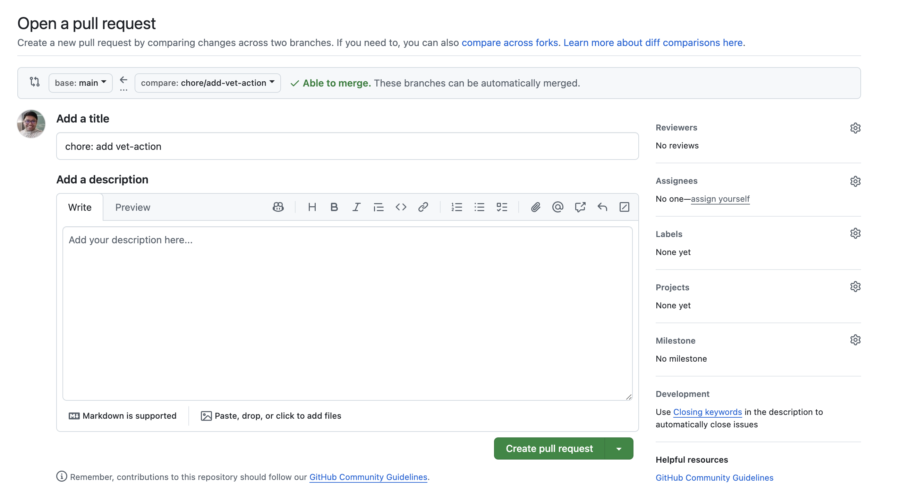
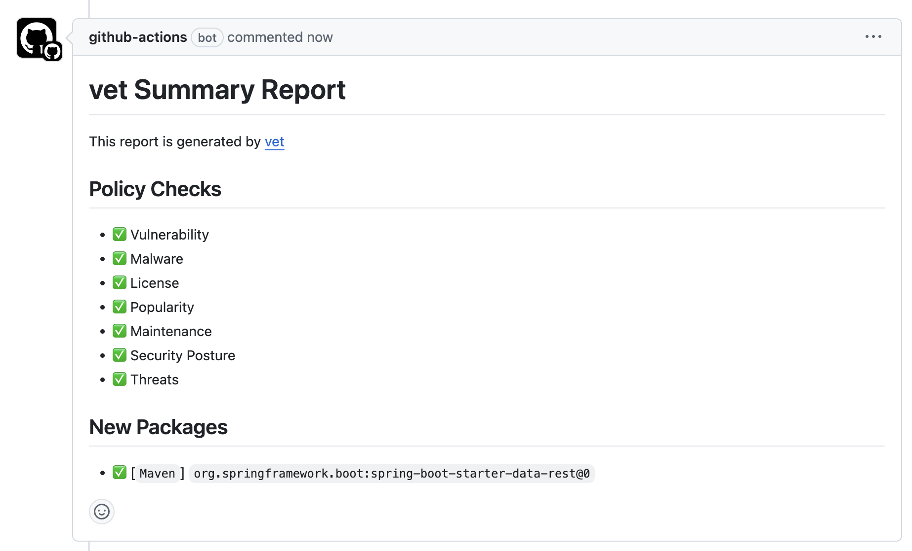

# 3.2.3 Introduction to vet

[vet](https://github.com/safedep/vet) is a tool for identifying risks in open
source software supply chain. It goes beyond just vulnerabilities and provides
visibility on OSS package risks due to it's license, popularity, security
hygiene, and more. `vet` is designed with the goal of helping software
development teams consume safe and trusted OSS components through automated
vetting in CI/CD.

## Integrating `vet` as a GitHub Action

[vet-action](https://github.com/safedep/vet-action) can be used to seamlessly
integrate `vet` into your GitHub Actions workflow. Run the commands below to
add `vet-action` to your repository.

Start by switching to the `main` branch and pulling the latest changes.

```bash
cd ~/playground/
git checkout main
git pull
```

Create a new branch called `chore/add-vet-action` and add `vet-action` as
a GitHub workflow in your repository

```bash
git checkout -b chore/add-vet-action
mkdir -p .github/workflows .github/vet
curl -o .github/vet/policy.yml -L https://raw.githubusercontent.com/safedep/vet-action/main/example/policy.yml
curl -o .github/workflows/vet-ci.yml -L https://raw.githubusercontent.com/safedep/vet-action/main/example/vet-ci.yml
```

Commit the changes and push the branch to the remote repository.

```bash
git add .github/vet/policy.yml .github/workflows/vet-ci.yml
git commit -m "chore: add vet-action"
git push origin chore/add-vet-action
```

Create a pull request and merge the changes to the `main` branch.



## Triggering the `vet` workflow

`vet` workflow is triggered only when a pull request is created changing
`pom.xml` file in the repository. To trigger it

```bash
cd ~/playground
patch -p1 <<_EOF
diff --git a/app/pom.xml b/app/pom.xml
index 44fb229..40cec3f 100644
--- a/app/pom.xml
+++ b/app/pom.xml
@@ -34,6 +34,10 @@
 			<groupId>org.springframework.boot</groupId>
 			<artifactId>spring-boot-starter-web</artifactId>
 		</dependency>
+		<dependency>
+			<groupId>org.springframework.boot</groupId>
+			<artifactId>spring-boot-starter-data-rest</artifactId>
+		</dependency>

 		<dependency>
 			<groupId>io.micrometer</groupId>

_EOF
git status
git add .
git commit -m "triggering sca"
git push --set-upstream origin chore/add-vet-action
```

## View PR

Navigate to the GitHub UI and view the pull request. You should see the `vet`
workflow running. A comment is added to the pull request with the results of
the `vet` scan.



## Customizing Policy

All `vet` policies are defined in the `.github/vet/policy.yml` file. You can customize the
policy to suit your organization's needs. For example, you can add or remove
rules, change the severity of a rule, or add a new rule. Refer to [policy as
code documentation](https://docs.safedep.io/advanced/policy-as-code)
