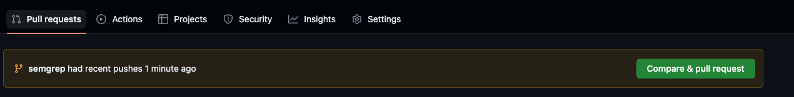
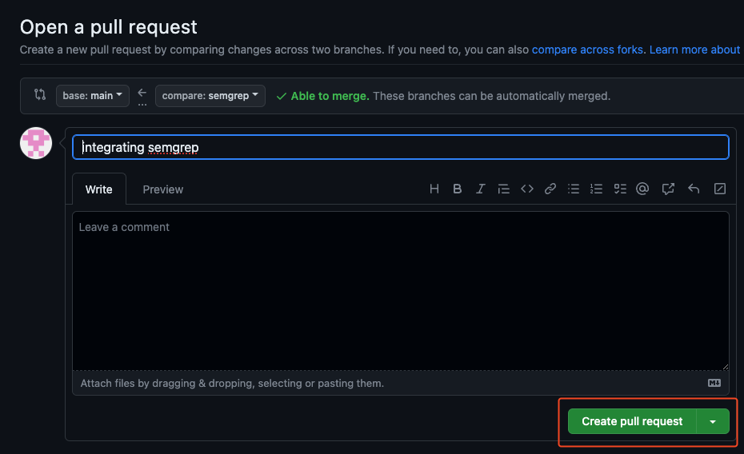
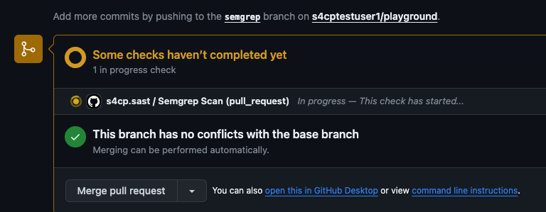
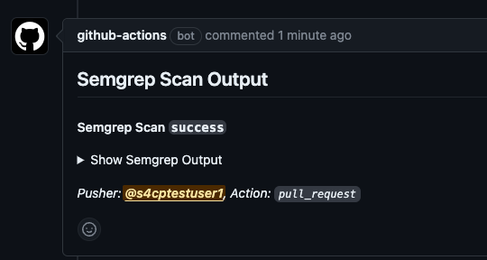
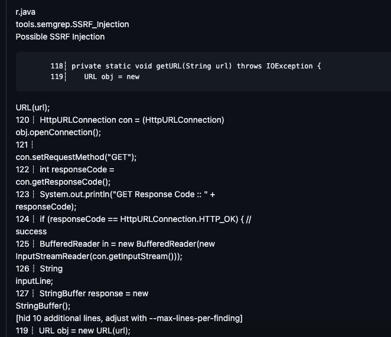
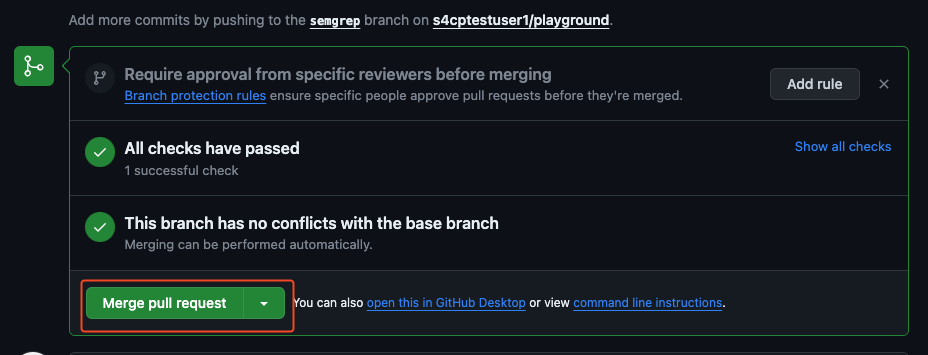
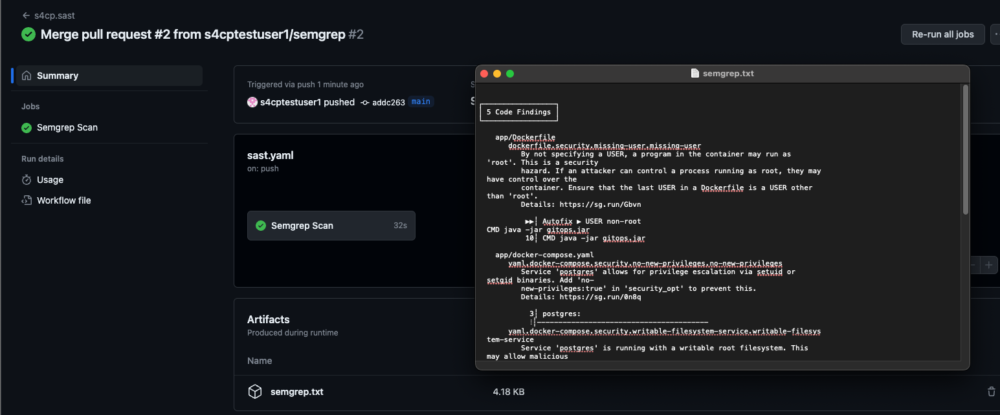

# Semgrep Integration with GHA

Now let's integrate semgrep with Github Actions and also look at how we can fix the issues that've been identified.

## Semgrep Command

Let's first try to understand the actual command that needs to be executed in Github Actions.

- `--config=tools/semgrep` : Custom semgrep rules that we wish to execute
- `--config=auto` : Community rules located at [https://semgrep.dev/p/default](https://semgrep.dev/p/default)
- `--include=app` : The folder on which all the above rules need to be executed.

```bash
semgrep scan --config=tools/semgrep --config=auto --include=app
```

## Prepare the Code

Let's prepare the code now for running semgrep.

```bash
cd ~/playground/
git checkout main
git pull
cp -r ~/s4cpcode/chapter3/3B/. .
```

- The commands below will create a new branch called `semgrep` and push the changes into the branch.


```bash
git checkout -b semgrep
git status    
git add .
git commit -m "integrating semgrep"
git push --set-upstream origin semgrep
```

## Create PR

Let's create a PR from `semgrep` branch to `main` branch





## View PR

View the PR comments as shown below especially that displaying the semgrep output as shown below







## Merge PR

- Merge the PR and commit the changes.



## View Semgrep Artifact

- Once the PR is merged Semgrep GHA will produce an artifact containing compelete semgrep output as shown below.


