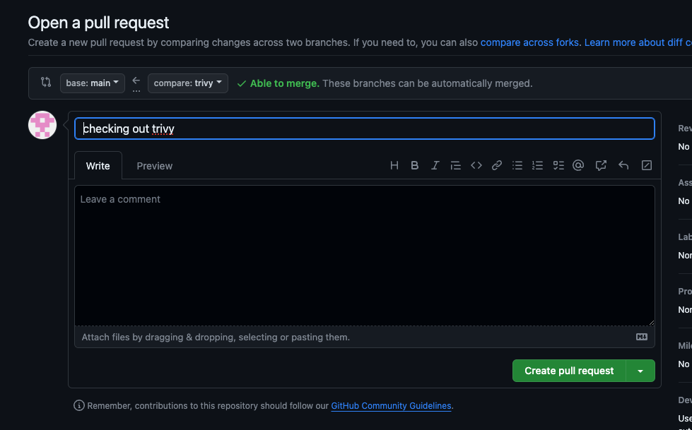
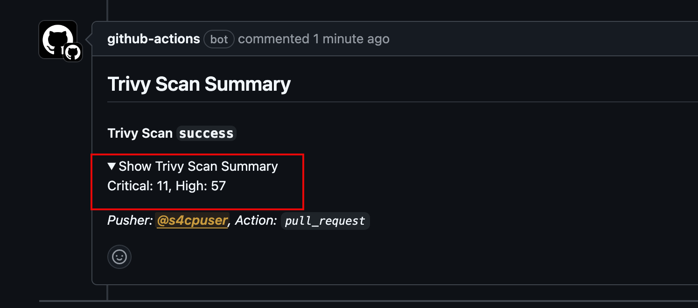
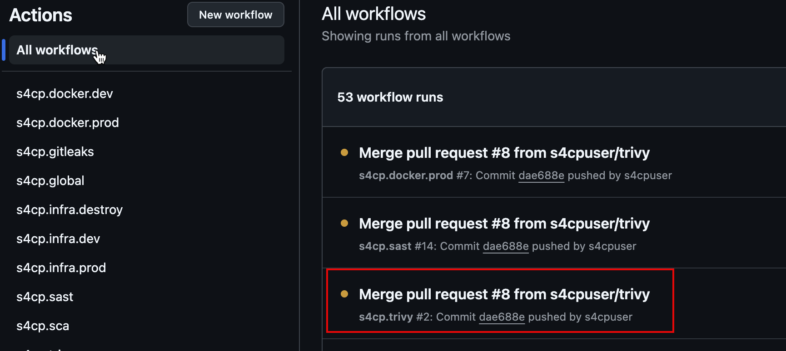
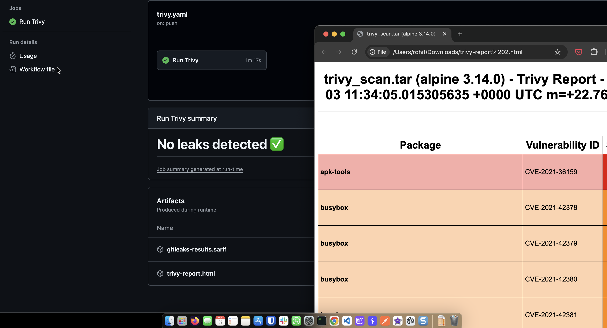
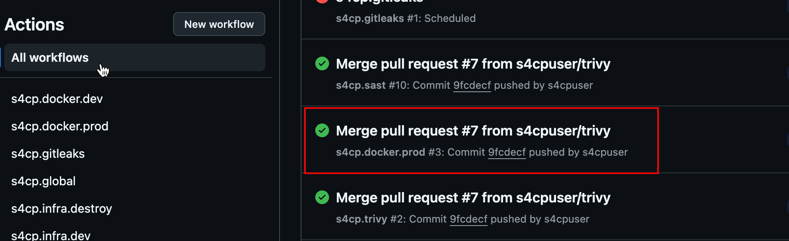
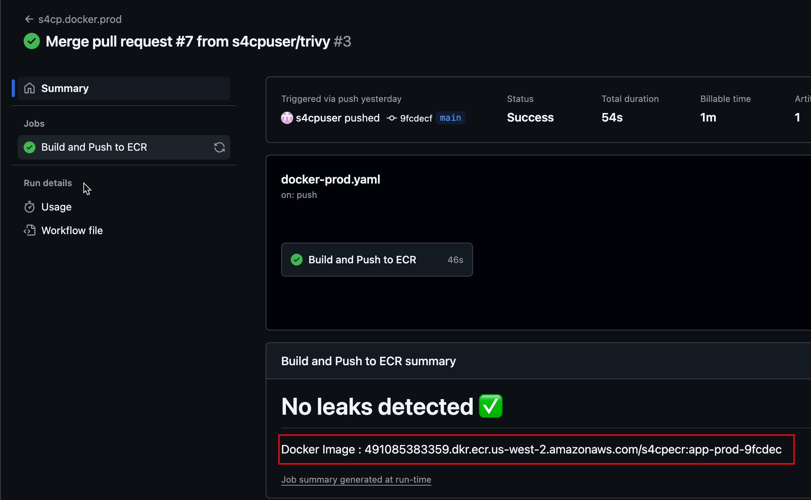

# Integrating Trivy with GHA

Let's integrate trivy in the Github Actions using a custom workflow `trivy.yaml` using the below command

```bash
cd ~/playground/
git checkout main
git pull
cp -r ~/s4cpcode/chapter4/4D/. ~/playground/
git status
git add .
git commit -m "Integrating Trivy with GHA"
git push
```

## ⚡ Triggering Trivy  

- Now that the Github Actions workflow is added, let's trigger it using the command below which will update the necessary code to trigger trivy and also created a new branch called `trivy`

```bash
cd ~/playground/
cp -r ~/s4cpcode/chapter4/4DD/. ~/playground/
git checkout -b trivy
git status
git add .
git commit -m "checking out trivy"
git push --set-upstream origin trivy
```

## 🔄 Create PR

Let's create a PR from the newly created `trivy` branch to `main` branch



## 👁️ View PR

- Trivy GHA Started


- Trivy Score



## 🔀 Merge the PR

- Let's now merge the PR in order to view the complete Trivy report which will be shared as an artifact


## 👁️ View Trivy Artifact

Once the complete Trivy and Docker Github actions complete, we can now view the artifact shared by the trivy workflow containing details of the vulnerabilities

- Open Trivy Workflow



- Trivy Report




## 📝 Make note of Docker Image

Once the Docker Github Action workflow is complete, ensure to make a note of the docker image name in the output and paste it into the notes.md `Docker CI` section as shown below 

- Open the Github Action for Docker that is executed after merge as shown below



- Copy the Docker image name as shown below and paste it into notes.md.



:::warning Docker Image

Please ensure to note the above docker image name as we'll be requiring it to run it on the Kubernetes infrastructure in the next chapter.

:::note End of Chapter 4

That completes the Chapter 4, before you move to Chapter 5

- Ensure your [Docker CI Github Actions](/docs/chapter4-securing-container/docker_continous_integration/running_docker_ci.md) is all set up and running.
- Ensure you have understood what a [Golden Docker Image](/docs/chapter4-securing-container/golden_docker_images/secure_dockerfile.md) is and have it setup and also made a note of the [Docker Image](/docs/chapter4-securing-container/golden_docker_images/secure_dockerfile.md#-make-note-of-docker-image/)
- Ensure you have integrated [Trivy](/docs/chapter4-securing-container/container_security/integrating_trivy_gha.md) in your GHA.
:::