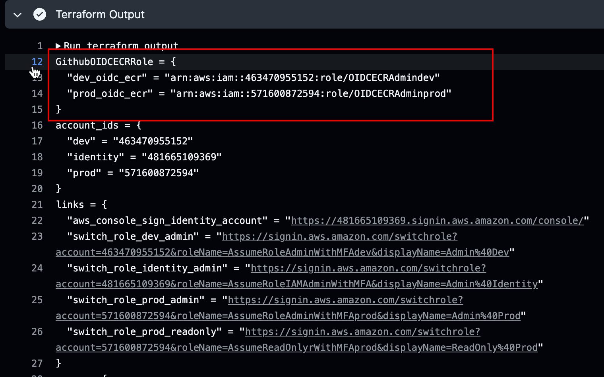
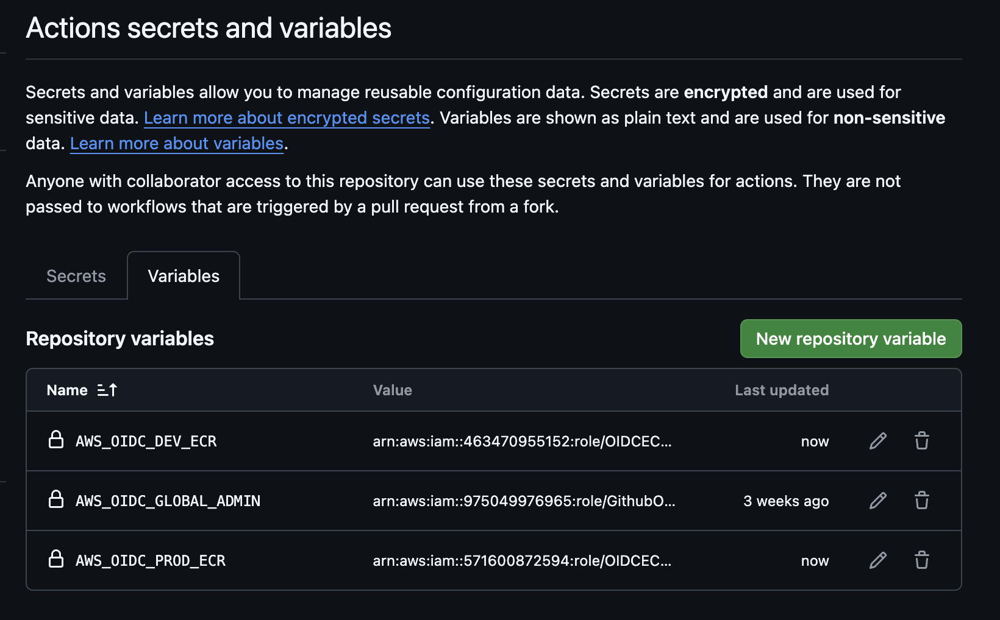

# 4.1.2 ECR IAM Role

In order to be able to push our images into AWS ECR,Github Actions will need the requisite permissions to be able to interact with AWS. For this purpose we shall create a separate IAM Role with OIDC integration just for the purpose of interacting with ECR. 

:::tip Least Privelege

We could use our existing OIDC Admin role, but through this I wanted to demonstrate the possibility of creating least privilege scenarios as well.

:::

## 🔨 Creating and Accessing ECR

Following command will prepare the code to create two IAM Roles `OIDCECRAdminprod` and `OIDCECRAdmindev` and also two ECR registries one for each environment with the name `s4cpecr`.

```bash
cd ~/playground/
git checkout main
git pull
cp -r ~/s4cpcode/chapter4/4A/. ~/playground/
```

## ✏️ Edit `global/accounts.tf` file

- In order to establish the OIDC connect between AWS and Github we need to again specify the repository in the variables as shown below.
- Just replace username with your Github username.

```hcl title="global/accounts.tf"
variable "github_account_repo" {
  description = "Github Account and Repository that will be interacting with AWS OIDC"
  default       = "<username>/playground" #@CHANGEME
  type        = string
}
```

- Now that's done let's push the code.

```bash
git status
git add .
git commit -m "creating and accessing ECR"
git push
```

### 👁️ Terraform Output

- Make a note of the terraform output and copy the values in notes.md file This is the OIDC IAM Role that will be used by Github to authenticate into AWS.



## ⚙️ Create Github Config

- Visit Github.com->Settings->Secrets and Variables->Actions->Variable and add the variables as shown below
  - `AWS_OIDC_DEV_ECR` for Dev
  - `AWS_OIDC_PROD_ECR` for Prod

