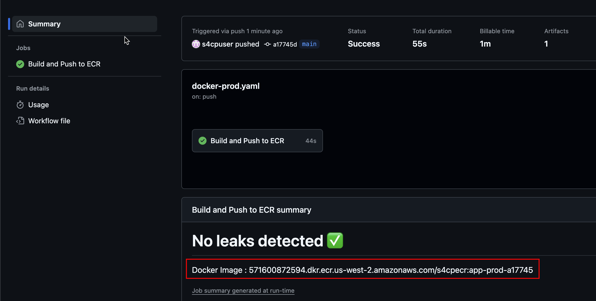

# 4.1.3 Running Docker CI

[Youtube 📺](https://www.youtube.com/watch?v=Am9417a87zU&t=4906s)

- Now the final step for building our docker images and that is to push the `docker-prod.yaml` workflow that will build the docker images and consequently push them to the ECR registry (for Prod)

```bash
cd ~/playground/
cp -r ~/s4cpcode/chapter4/4B/. ~/playground/
git status
git add .
git commit -m "running docker ci"
git push
```

## 🧱 Immutable Docker Image

- Visit github.com and Click on Summary and view the Docker Github Actions workflow that we just pushed.
- It should output the docker image value as shown below

