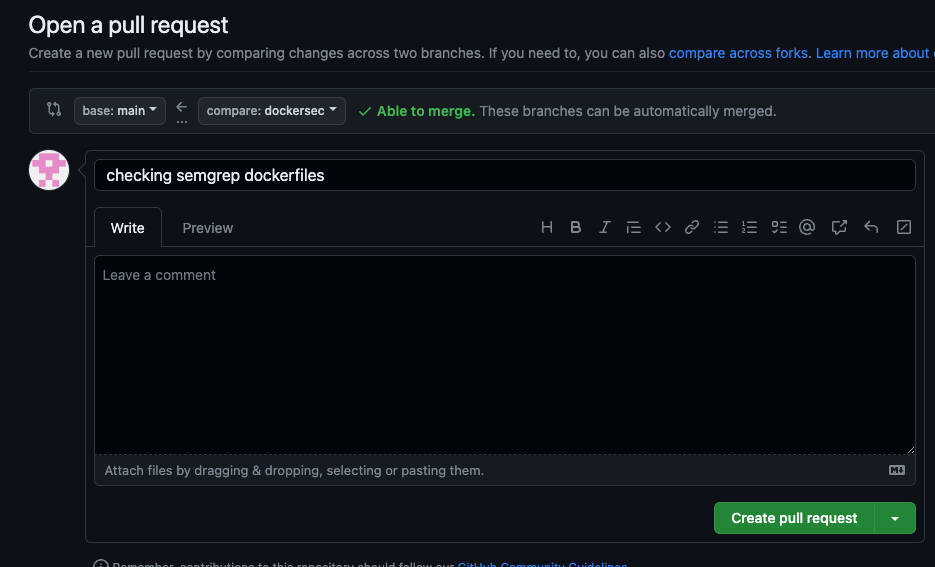
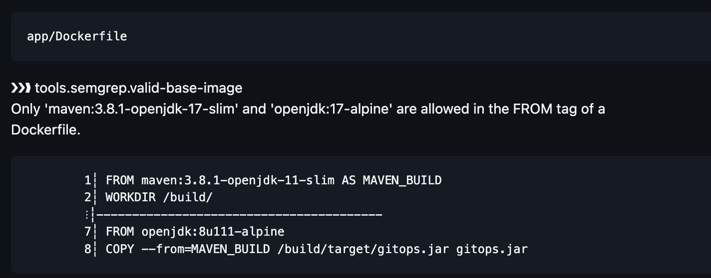
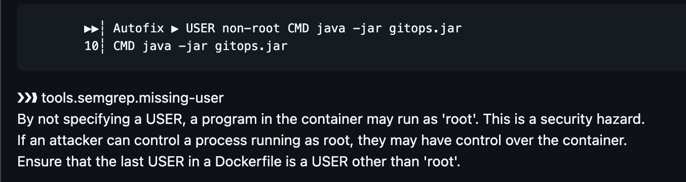

# Dockerfile Security Github Actions

Let's run the rules discussed in the previous section as part of our Semgrep workflow and observe the output. The commands below will add these two rules to `tools\semgrep` folder and run the SAST workflow and also create a separate branch called `dockersec`

## 📄 Dockerfile Semgrep Rules

- This command checks-in two Semgrep rules for Docker and creates a new branch called dockersec

```bash
cd ~/playground/
cp -r ~/s4cpcode/chapter4/4C/. ~/playground/
git checkout -b dockersec
git status
git add .
git commit -m "dockerfiles semgrep rules"
git push --set-upstream origin dockersec
```

## 🔄 Create PR

- Create a Pull Request from `dockersec` branch to `main` branch of the repository as shown below



## 👁️ View PR

View the results of semgrep spooled out into PR comments as shown below 

- Validation for Base Image



- Validation for Non-Root User
  
