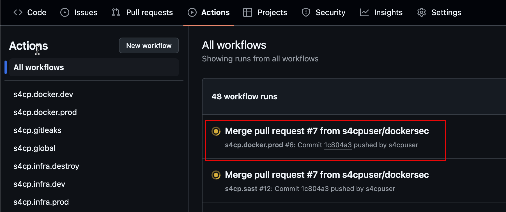
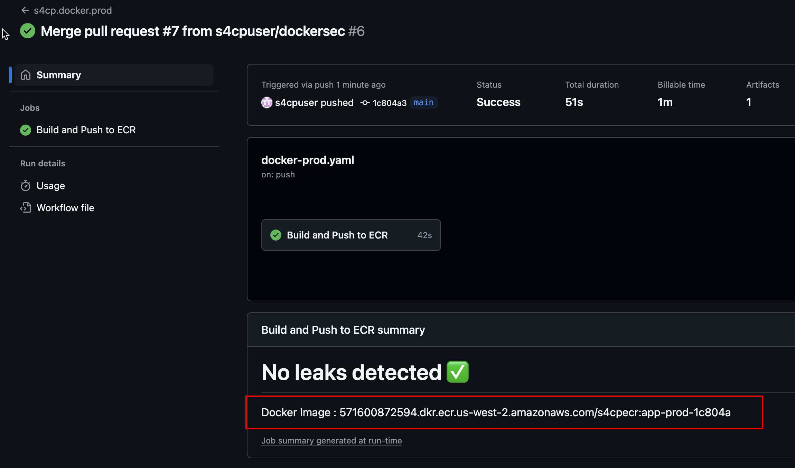

# Secure Dockerfile

Let's now fix these issues by updating the dockerfile with the following command.

```bash
cd ~/playground/
cp -r ~/s4cpcode/chapter4/4CC/. ~/playground/
git status
git add .
git commit -m "checking in secure Dockerfile"
git push --set-upstream origin dockersec
```


The command above will push the below secure dockerfile into github and re-run semgrep.

```dockerfile
FROM maven:3.8.1-openjdk-17-slim AS MAVEN_BUILD
WORKDIR /build/
COPY pom.xml /build/
COPY src /build/src/
RUN mvn package

FROM openjdk:17-alpine
RUN addgroup boot && adduser -D -h /home/boot -s /bin/ash boot -G boot
USER boot
WORKDIR /home/boot
COPY --from=MAVEN_BUILD /build/target/gitops.jar /home/boot/gitops.jar
EXPOSE 8080
CMD java -jar /home/boot/gitops.jar
```

## 👁️ View PR

View the PR Comments and it'll now show the semgrep docker rules have passed as shown below only 6 issues as compared to 10 earlier.


## 🔀 Merge the PR

Let's now merge the PR and allow the Docker Github Action workflow continue to run.


## 📝 Make note of Docker Image

Once the Docker Github Action workflow is complete, ensure to make a note of the docker image name in the output and paste it into the notes.md `Docker CI` section as shown below 

- Open the Github Action for Docker as shown below



- Copy the Docker image name as shown below and paste it into notes.md.



:::warning Docker Image

Please ensure to note the above docker image name as we'll be requiring it to run it on the Kubernetes infrastructure in the next chapter.

:::

