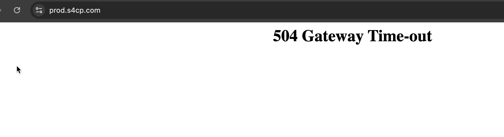

# Introduction to Calico

Calico is an open-source networking and security solution designed to enhance the networking capabilities of Kubernetes clusters, including those running on AWS EKS with the Default VPC CNI. It offers advanced networking features, fine-grained network policies, and robust security controls, making it a valuable choice for organizations seeking to strengthen the security and control of their EKS clusters.

## ⚡ Installing Calico

Let's go ahead and install Calico CNI plugin using the command below.

```bash
cd ~/playground/
cp -r ~/s4cpcode/chapter5/5G/. ~/playground/
git status
git add .
git commit -m "installing calico"
git push
```

## ❌ Application Down

2 Minutes after applying the Calico CNI plugin if we now view the application it'll give us a 500 error response as shown below



This is happening because we applied a default deny policy for all pods after installing the calico CNI plugin. This shows that the plugin was successfully installed. The Default deny policy applied using Terraform is as shown below. This policy blocks all communication in all pods in a specific namespace which is `s4cp` in our case.

```toml
resource "kubernetes_network_policy" "default_deny" {
  metadata {
    name      = "default-deny"
    namespace = "s4cp"
  }

  spec {
    pod_selector {
      match_labels = {}
    }

    policy_types = ["Ingress", "Egress"]
  }

  depends_on = [resource.helm_release.calico]
}
```


