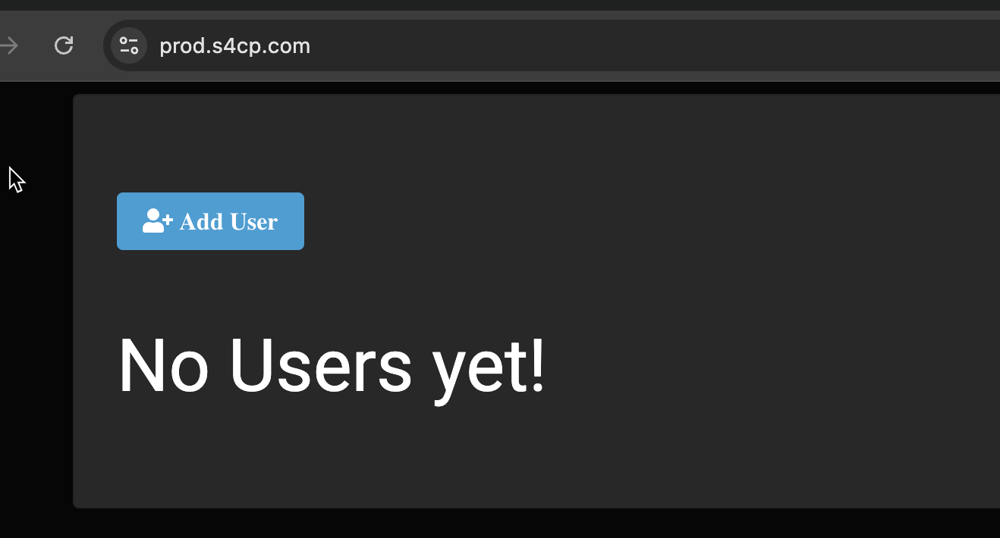
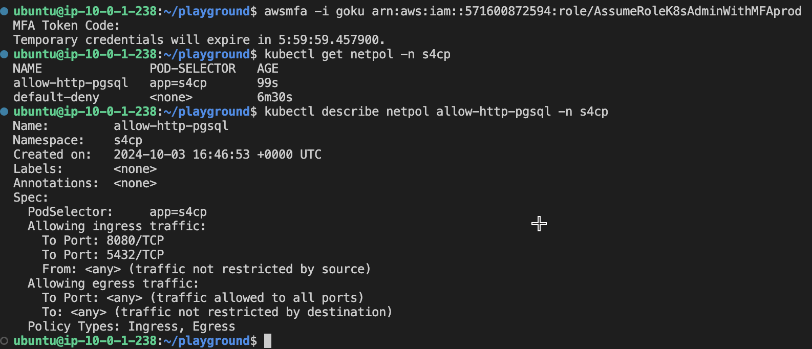

# 5.5.3 Network Security Policy

[Youtube 📺](https://www.youtube.com/watch?v=Am9417a87zU&t=7053s)

The Network Security Policy that we now need to apply in order to enable communication within the subjected namespace is as shown below.

```toml
# Allow Only ports 8080 and 5432 in ingress. Egress All
resource "kubernetes_network_policy" "allow_http_pgsql" {
  metadata {
    name      = "allow-http-pgsql"
    namespace = "s4cp"
  }

  spec {
    pod_selector {
      match_labels = {
        app = "s4cp"
      }
    }
    ingress {
      ports {
        port     = "8080"
        protocol = "TCP"
      }
      ports {
        port     = "5432"
        protocol = "TCP"
      }
    }
    egress {}
    policy_types = ["Ingress", "Egress"]
  }
}
```

This Network Policy is designed to control the network traffic for pods labeled "app=s4cp" in the "s4cp" namespace. It allows incoming traffic on ports 8080(Application) and 5432(Database) while leaving egress traffic unrestricted. This policy enforces security controls on network communication for pods with the specified label selector.

## ▶️ Applying NetPol

Let's apply the above network security policy using the command below, which will make our app working again !

```bash
cd ~/playground/
cp -r ~/s4cpcode/chapter5/5I/. ~/playground/
git status
git add .
git commit -m "installing netpol"
git push
```

## 🚀 Application Up

- If we now view the application it is working perfectly now !



## 👁️ View NetPol

- Login as Goku and then view the NetPolicy as shown below

```bash
awsmfa -i goku arn:aws:iam::<prod-ic>:role/AssumeRoleK8sAdminWithMFAprod
kubectl get netpol -n s4cp
kubectl describe netpol allow-http-pgsql -n s4cp
```



:::note End of Chapter 5

That completes the Chapter 5, for chapter 6 there is no dependency on Chapter 5 but has dependencies on the chapters 1,2,3

- We setup the [Kubernetes Prod Infrastructure](/docs/chapter5-securing-cluster/production_setup/setting_up_prod.md) from scratch
- We then applied [Kubernetes RBAC](/docs/chapter5-securing-cluster/kubernetes_rbac/creating_k8s_rbac.md) to ensure least privilege is applied.
- We then [Encrypted Kubernetes Secrets](/docs/chapter5-securing-cluster/secrets_and_encryption/encrypting_k8s_secrets.md) and [implemented a Secrets Manamgement using AWS Secrets Manager and Secrets CSI Driver](/docs/chapter5-securing-cluster/secrets_and_encryption/secrets_management_k8s.md)
- We then explored Kubernetes runtime security using [Kyverno](/docs/chapter5-securing-cluster/k8s_runtime_security/k8s_runtime_security.md) and also evaluated a scenario where [only specific images are allowed](/docs/chapter5-securing-cluster/k8s_runtime_security/running_kyverno.md) to run on kubernetes.
- We then looked at how [Calico](/docs/chapter5-securing-cluster/k8s_network_security/introduction_to_calico.md) helped us implement [network security policy](/docs/chapter5-securing-cluster/k8s_network_security/network_security_policy.md)
:::
