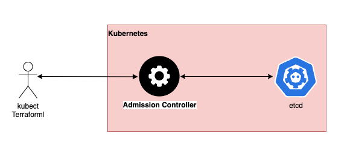

# 5.4.1 K8s Runtime Security

[Youtube 📺](https://www.youtube.com/watch?v=Am9417a87zU&t=6634s)

Kubernetes runtime security, with the help of admission controllers, enforces policies on running workloads, ensuring they comply with security best practices. This includes managing network access, scanning for vulnerabilities, adapting to changing requirements, and responding to security incidents.

Admission controllers in Kubernetes are a set of security and policy checks that intercept requests made to the API server before resources are created or modified. They enforce policies related to authentication, authorization, resource constraints, and more. These controllers play a crucial role in ensuring the security, compliance, and integrity of Kubernetes clusters by making decisions on whether to admit or deny requests based on specified rules.

