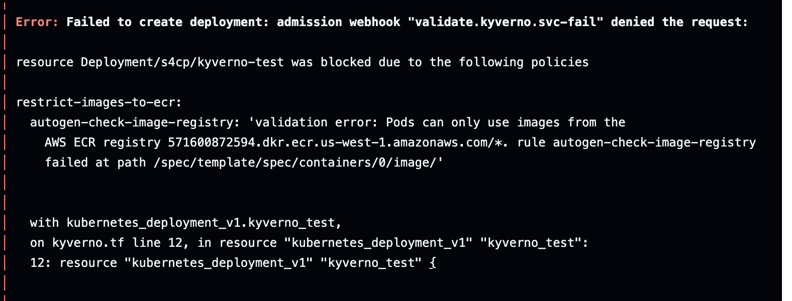

# 5.4.3 Running Kyverno

[Youtube 📺](https://www.youtube.com/watch?v=Am9417a87zU&t=6649s)

Let's practically run the provided Kyverno policy and test it out real-time.

## ⚡ Installing Kyverno
 
Let's go ahead and install Kyverno using the below command 

```bash
cd ~/playground/
cp -r ~/s4cpcode/chapter5/5F/. ~/playground/
git status
git add .
git commit -m "installing kyverno"
git push
```

## 🧪 Testing Kyverno

Now that Kyverno has been installed let's also test it out by running a Deployment whose image is non-compliant.

```bash
cd ~/playground/
cp -r ~/s4cpcode/chapter5/5FF/. ~/playground/
git status
git add .
git commit -m "testing kyverno"
git push
```



