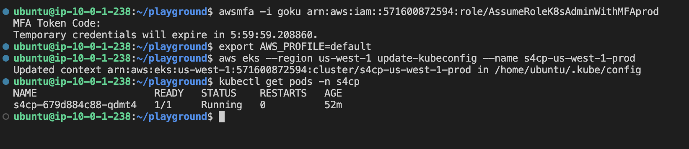
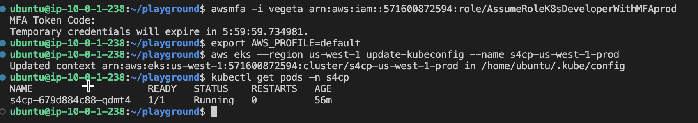
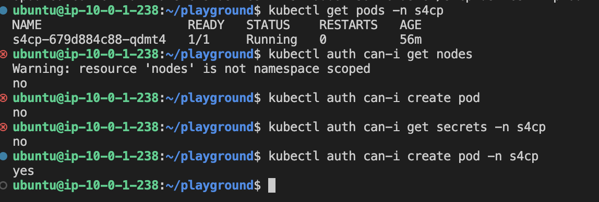

# 5.2.3 Accessing Kubernetes

[Youtube 📺](https://www.youtube.com/watch?v=Am9417a87zU&t=6219s)

Let's now access kubernetes using CLI for both our users `goku` and `vegeta`

## 🔒 Accessing K8s - Goku

Let's now attempt to access K8s not using terraform but using the users and their corresponding IAM Roles.

### 🔐 Authenticating using Goku

> Please replace `<prod-account-id>`

First, we need to authenticate using the AWS IAM Role that has been assigned to Goku in prod account i.e.
`arn:aws:iam::<prod-account-id>:role/AssumeRoleK8sAdminWithMFAprod`

```bash
awsmfa -i goku arn:aws:iam::<prod-account-id>:role/AssumeRoleK8sAdminWithMFAprod
```

### ⚙️ Configuring Kubernetes

Let's now update the kubeconfig so that real permissions of Goku is updated.

```bash
export AWS_PROFILE=default
aws eks --region us-west-1 update-kubeconfig --name s4cp-us-west-1-prod
kubectl get pods -n s4cp
```



### 🧪 Testing Goku's Authz

Fire the below commands to test out the RBAC that has been implemented. 

```bash
kubectl auth can-i get nodes
kubectl auth can-i create pod
kubectl auth can-i get secrets -n s4cp
```


Answer should be `yes` for all as Goku is admin.

## 🔒 Accessing K8s - Vegeta

Let's now attempt to access K8s not using terraform but using the users and their corresponding IAM Roles.

### 🔐 Authenticating using Vegeta

First, we need to authenticate using the AWS IAM Role that has been assigned to Vegeta in prod account i.e.
`arn:aws:iam::<prod-account-id>:role/AssumeRoleK8sDeveloperWithMFAprod`

> Please replace `<prod-account-id>`

```bash
awsmfa -i vegeta arn:aws:iam::<prod-account-id>:role/AssumeRoleK8sDeveloperWithMFAprod
```

### ⚙️ Configuring Kubernetes

Let's now update the kubeconfig so that real permissions of Vegeta is updated.

```bash
export AWS_PROFILE=default
aws eks --region us-west-1 update-kubeconfig --name s4cp-us-west-1-prod
kubectl get pods -n s4cp
```



### 🧪 Testing Vegeta's Authz

Fire the below commands to test out the RBAC that has been implemented

```bash
kubectl auth can-i get nodes
kubectl auth can-i create pod
kubectl auth can-i get secrets -n s4cp
kubectl auth can-i create pod -n s4cp
```



Answer should be `yes` for only the last command i.e. `kubectl auth can-i create pod -n s4cp` as the developer is allowed to operate only in a specific namespace i.e. `s4cp` where the application is deployed.