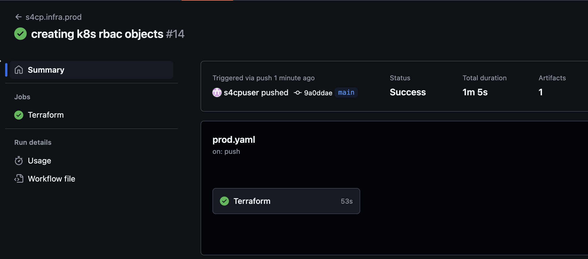

# 5.2.2 Creating K8s RBAC

Now that we've learnt about Kubernetes RBAC let's get to create it

## 🛠️ Preparing Code for K8s IAM Roles

Below command will create the AWS IAM Roles that our users `goku` and `vegeta` will need to assume in order to access k8s through kubectl

```bash
cd ~/playground/
cp -r ~/s4cpcode/chapter5/5B/. ~/playground/
git status
git add .
git commit -m "aws iam roles for k8s"
git push
```

Following AWS IAM Roles will be created

| Name                              | Type       | Account  | User       |
|-----------------------------------|------------|----------|------------|
| AssumeRoleK8sAdminWithMFAprod     | IAM Role   | prod     | goku       |
| AssumeRoleK8sDeveloperWithMFAprod | IAM Role   | prod     | vegeta     |
| AssumeRoleK8sAdminWithMFAdev      | IAM Role   | dev      | goku,vegeta|

All the above IAM Roles have the same permissions i.e.

`eks:DescribeCluster,eks:ListClusters`

Its worth noting and that these roles don't need any special AWS permissions to access EKS other than the ones listed above. The primary purpose of these roles is to only provide identity that is needed to authenticate to EKS.
The actual permissions are tied to the Kubernetes Role to which they are mapped in `aws-auth`

## ⚙️ Preparing Code K8s RBAC

Below command will create the Kubernetes Role and RoleBinding objects and map them to the AWS IAM Roles created above in the `aws-auth` configmap.

```bash
cd ~/playground/
cp -r ~/s4cpcode/chapter5/5C/. ~/playground/
git status
git add .
git commit -m "creating k8s rbac objects"
git push
```

