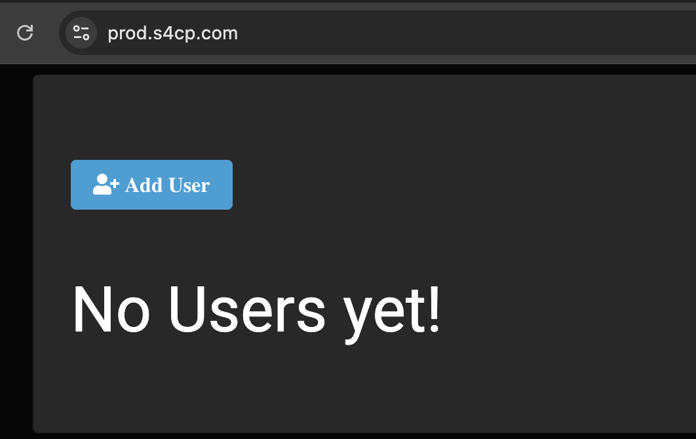
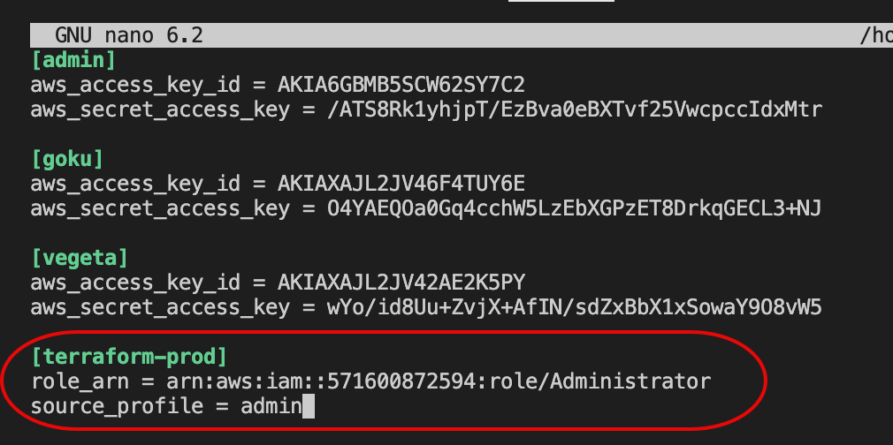
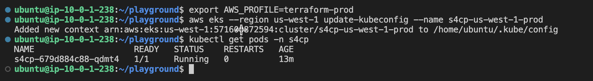

# Accessing Prod Infrastructure

- Let's now access the application from the browser and CLI

## Viewing the Application

The application once deployed, can be accessed at [https://prod.yourdomain.com](https://prod.yourdomain.com)



## Open AWS Credentials File

- Open the aws credentials file using the below command.

```bash
nano ~/.aws/credentials
```

## Configure AWS Credentials File

Add the below lines of code into the file as we need to assume the specific role to access the prod account.

```toml
[terraform-prod]
role_arn = arn:aws:iam::<prod-account-id>:role/Administrator
source_profile = admin
```



## Accessing Kubernetes from CLI

Using the below commands we can now access the kubernetes using kubectl

```bash
export AWS_PROFILE=terraform-prod
aws eks --region us-west-1 update-kubeconfig --name s4cp-us-west-1-prod
kubectl get pods -n s4cp
```

