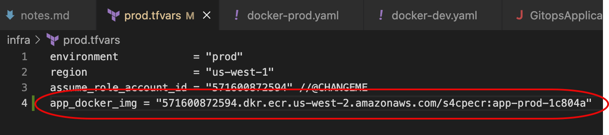
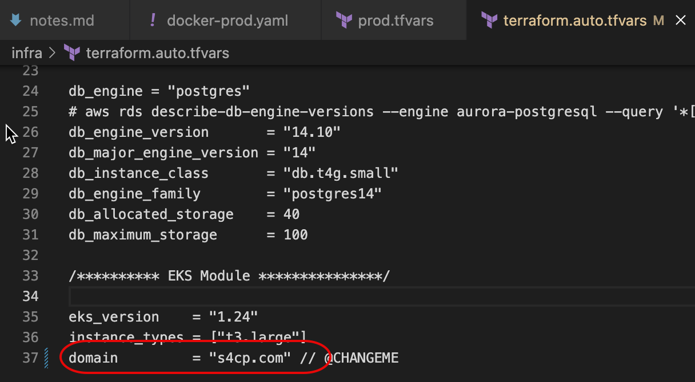
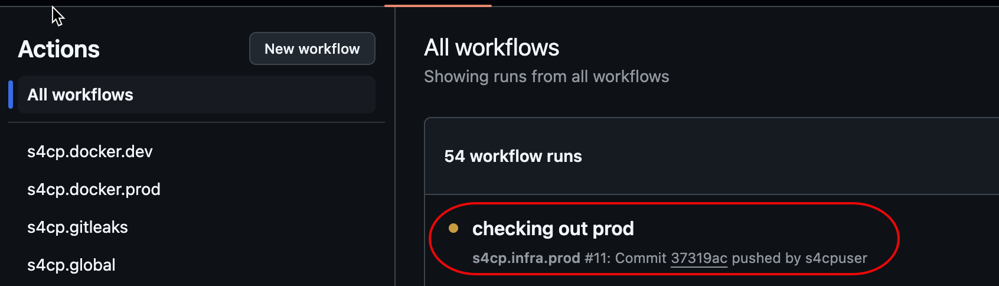
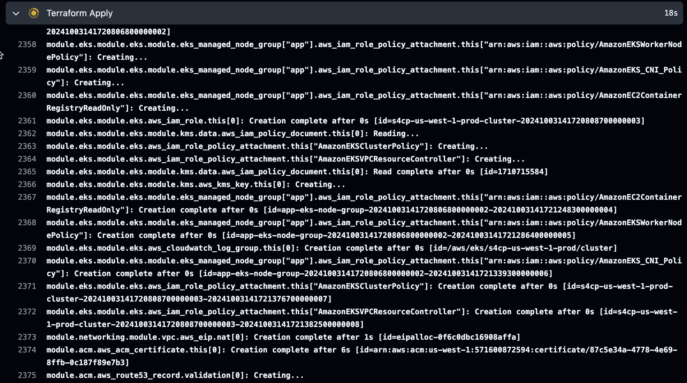
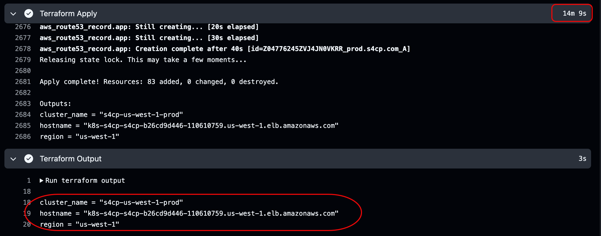

# Setting Up Infrastructure


Following are the components that will be setup in this section on AWS 

- **EKS** : An AWS managed Kubernetes cluster with version 1.24
- **ELB** : AWS ELBv2 Load balancer acting as an ingress controller
- **RDS** : An AWS managed PostgreSQL database server for storing user supplied data
- **VPC** : An AWS managed Virtual Private Cloud hosting all the networking services with three subnets public,private and database. EKS Nodes will be provisioned in private subnet and RDS in database subnet.
- **Route 53** : A Route53 record to map a human readable hostname mapped to the Kubernetes ingress controller hostname. The domain name will be mapped according to the environment for ex: for prod it will `prod.yourdomain.com`
- **ACM** : An SSL Certificate used for HTTPS communication for public internet.
- **Security Groups** : Security groups for controlling network access.
- **K8s Components** : Deployments,Service and Ingress resources created for running the application. All these components are also deployed in a specific namespace i.e. `s4cp`.

## 🛠️ Prepare the Code

Prepare the code necessary for provisioning the kubernetes environment 

```bash
cd ~/playground/
git checkout main
git pull
cp -r ~/s4cpcode/chapter5/5A/. ~/playground/
```

## ➕ Add Docker Image

- Copy the Docker Image name saved in the [last chapter](/docs/chapter4-securing-container/golden_docker_images/dockerfile_security_gha.md)
- Open `infra/prod.tfvars` and add the variable `app_docker_img` with the value copied from above.



:::warning Docker Image
This is an extremely critical step and must be executed with caution.
:::

## 🌐 Add Domain Name

- Open `infra/terraform.auto.tfvars` and add the domain name that [you've configured](/docs/chapter0-the-setup/domain-setup.md) 



## ✨ Provisioning the Infrastructure

Let's now go ahead and push the changes so that GHA workflow will be triggered and our Production infrastructure with the services will be provisioned. The command below needs to be executed and will prompt you to check if you have updated the docker image in `infra/prod.tfvars`

```bash
cd ~/playground/
git status
git add .
git commit -m "checking out prod"
git push
```

## 👁️ View GHA

Provisioning this infrastructure would take about 15 minutes. So we can view the progress on GHA

- GHA Active



- Terraform Apply Started



- Terraform Apply Finished in about 15 minutes.

