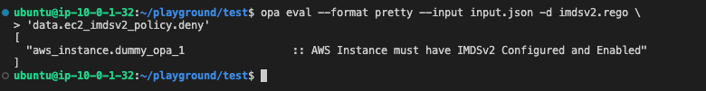
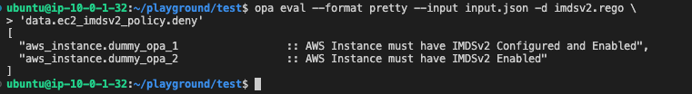

# 6.2.3 Enforcing IMDSV2 Through OPA

[Youtube 📺](https://www.youtube.com/watch?v=Am9417a87zU&t=7703s)

Below is the REGO file which we'll execute next that will help us identify any EC2 instances that donot have IMDSv2 enabled.

```python
package ec2_imdsv2_policy
 
import input as tfplan
 
deny[reason] {
	r = tfplan.resource_changes[_]
	r.type == "aws_instance"
    not r.change.after.metadata_options[0]
	reason := sprintf("%-40s :: AWS Instance must have IMDSv2 Configured and Enabled", [r.address])
}
```

The provided Rego policy is written in the context of Open Policy Agent (OPA) and is designed to enforce a specific requirement for AWS EC2 instances. Let's break down the Rego policy to understand its purpose and structure:

```python
package ec2_imdsv2_policy
```

- This line specifies the name of the Rego package, which is "ec2_imdsv2_policy." Packages in Rego are used to organize policies and rules into logical groups.

```python
import input as tfplan
```

- This line imports an external data source or input, named "tfplan," which is typically the Terraform plan data. The Rego policy will analyze and enforce rules based on this input.

```python
deny[reason] {
	r = tfplan.resource_changes[_]
	r.type == "aws_instance"
    not r.change.after.metadata_options[0]
	reason := sprintf("%-40s :: AWS Instance must have IMDSv2 Configured and Enabled", [r.address])
}
```

- This block defines a rule named "deny" that determines whether a specific condition is met.

  - `r = tfplan.resource_changes[_]`: This line iterates over all resource changes in the Terraform plan (`tfplan`) and assigns each change to the variable `r`.

  - `r.type == "aws_instance"`: This condition checks if the resource type in the Terraform plan is an "aws_instance." This rule specifically targets AWS EC2 instances.

  - `not r.change.after.metadata_options[0]`: This condition checks whether the AWS EC2 instance in the Terraform plan has metadata options configured. The `[0]` indicates the first metadata option. If no metadata options are found, the condition is true.

  - `reason := sprintf("%-40s :: AWS Instance must have IMDSv2 Configured and Enabled", [r.address])`: This line generates a reason string for the violation. It uses `sprintf` to format a message that indicates that an AWS EC2 instance must have IMDSv2 configured and enabled. The `r.address` variable contains the address of the AWS EC2 instance that violates the rule.

- Finally, `deny[reason]` specifies that the "deny" rule triggers a denial action when the conditions within the block are met. It returns the "reason" string as the reason for the denial.

In summary, this Rego policy enforces a requirement that AWS EC2 instances in a Terraform plan must have IMDSv2 (Instance Metadata Service Version 2) configured and enabled. If an EC2 instance in the plan does not meet this requirement, it will be denied, and a reason will be provided in the denial message. This policy helps ensure that EC2 instances adhere to a specific security configuration.

## 🚀 Running the OPA Policy

Let's now execute the above policy and to do that we need to execute the following command 

```bash
cd ~/playground/test
opa eval --format pretty --input input.json -d imdsv2.rego \
'data.ec2_imdsv2_policy.deny'
```



The command above is using OPA to evaluate a Rego policy against a specific input. Let's break down the command:

- `opa eval`: This is the OPA command used to evaluate policies against input data.

- `--format pretty`: This flag specifies the format in which you want the evaluation results to be displayed. In this case, "pretty" format is used, which makes the output more human-readable.

- `--input input.json`: This flag specifies the input data file, which is "input.json" in this case. The input data is used as context for policy evaluation. It provides the data against which the policy is checked.

- `-d imdsv2.rego`: This flag specifies the Rego policy file to be used for evaluation. The "imdsv2.rego" file contains the policy that will be checked against the input data.

- `'data.ec2_imdsv2_policy.deny'`: This is the query that tells OPA which part of the policy to evaluate. In this case, it's the "deny" rule from the "ec2_imdsv2_policy" package. OPA will check if the input data violates this rule.

So, the command is instructing OPA to evaluate the "deny" rule from the "ec2_imdsv2_policy" package in the "imdsv2.rego" policy file using the input data from "input.json." The results will be displayed in a human-readable "pretty" format, indicating whether the policy is satisfied or if there are violations.

## 🕸️ The Catch

In the previous OPA policy what we were trying to check is presence of `metadata_options[0]` variable to check if IMDSv2 is enabled or not. This can however be misleading as we can specify something like below 

```toml
  metadata_options {
    http_endpoint               = "enabled"
    http_tokens                 = "optional"
    http_put_response_hop_limit = 2
    instance_metadata_tags      = "disabled"
  }
```

Here, if `http_tokens = "optional"` then our previous OPA policy might pass it as the metadata_options is present but still IMDSv1 is configured.

The correct way to check if IMDSv2 is configured is to check for the following configuration `http_tokens = "required"`

Hence, let's modify the terraform code to introduce two more EC2 instances with and without the above configuration and then run an updated OPA policy and check if it works as expected.

## 🛠️ Preparing Code for IMDSv2

Let's run the below command which will include two more EC2 instances with and without the http_tokens configuration

```bash
cd ~/playground/
cp -r ~/s4cpcode/chapter6/6BB/. ~/playground/
cd test
```

## 📜 Terraform JSON Output

- Let's execute terraform to update the terraform plan with two new additional EC2 instances

```bash
export AWS_PROFILE=admin
terraform init && terraform plan --out tfplan.bin && terraform show \
-json tfplan.bin > input.json
cat input.json
```

## ➕ Preparing the New OPA File

- The below command will update the rego policy to include the check for http_tokens configuration.

```bash
cp -r ~/s4cpcode/chapter6/6BC/. ~/playground/
cd ~/playground/test
```

## 🚀 Executing the updated OPA Policy

- Let's now execute the same OPA eval command to execute the updated policies.

```bash
export AWS_PROFILE=admin
opa eval --format pretty --input input.json -d imdsv2.rego \
'data.ec2_imdsv2_policy.deny'
```

- It should now catch all EC2s with IMDSv2 configured as well as enabled.



