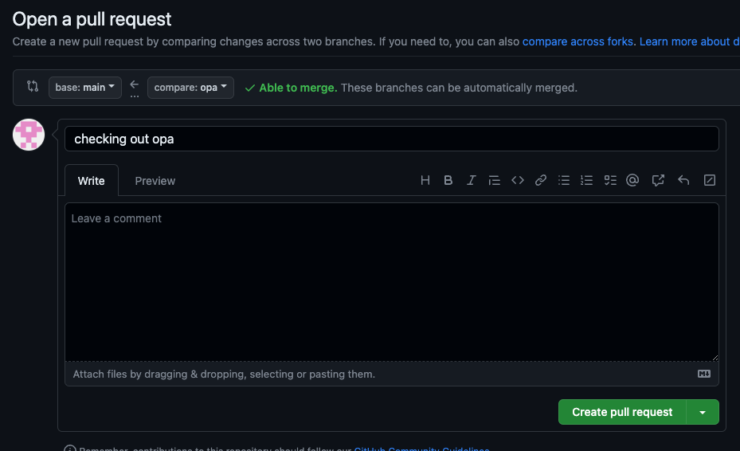
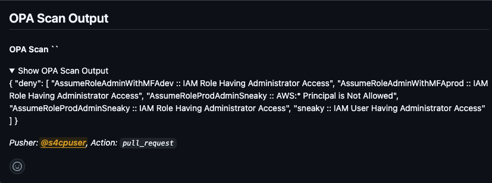
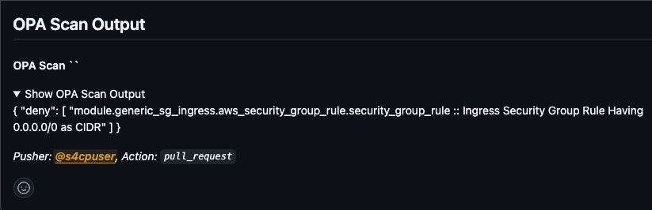
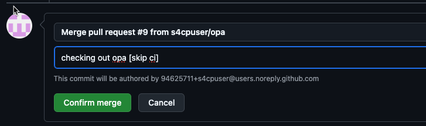

# Integrating OPA with GHA

Now that we've seen the power of OPA and how it can help identify cloud misconfiguration before they are applied, let's look at how we can automated running OPA using Github Actions !

## 🛠️ Preparing Code

The below command shall update the code to include Github Actions for OPA and also create a new branch called `opa`

```bash
cd ~/playground/
cp -r ~/s4cpcode/chapter6/6C/. ~/playground/
git checkout -b opa
git status
git add .
git commit -m "checking out opa"
git push --set-upstream origin opa
```

## 🔄 Create PR 

Let's create a PR from `opa` branch to `main` branch as shown below



## 👁️ View the PR Comments

Check the results of OPA in PR Comments 

- OPA Scan output for Global Infrastructure , showing excessive permissions being attached



- OPA Scan output for Prod Infrastrucutre , showing excessive permissions attached to a security group



## 🛠️ Preparing Code for Rolling Back

Let's roll back the changes by firing the below commands , as we donot wish to commit the above identified abnormalities in the code.

```bash
cd ~/playground/
cp -r ~/s4cpcode/chapter6/6D/. ~/playground/
git status
git add .
git commit -m "rolling back changes"
git push --set-upstream origin opa
```

## 🔀 Merge the PR

Lastly, we need to close the PR by merging the `opa` branch into `main` branch with **[skip ci]** in comments.



:::warning [skip ci]

Its important here to add the string **[skip ci]** in the message as we don't wish to run the Github Actions upon the merge.
Same can be seen in the screenshot below.

1. First enter **[skip ci]** in the comment.
2. Click on `Close with comment` button.

:::

:::note End of Chapter 6

That completes the Chapter 6 and of the course 🎉🎊🎉🎊🎉🎊🎉🎊🎉🥳 , highligthing what we've learned in Chapter 6

- We installed and executed [Service Control Policies](/docs/chapter6-securing-cloud/service_control_policies/introduction_to_scps.md) and observed how they can truly help us in shifting left towards our compliance policies.
- Next, we spent a lot of time on [Open Policy Agent](/docs/chapter6-securing-cloud/open_policy_agent/introduction_to_opa.md) by learning a policy on [How to enforce IMDSv2](/docs/chapter6-securing-cloud/open_policy_agent/enforcing_imdsv2.md)
- Then we saw how can OPA be [integrated into GHA](/docs/chapter6-securing-cloud/open_policy_agent/integrating_opa_gha.md) in this section.

:::


