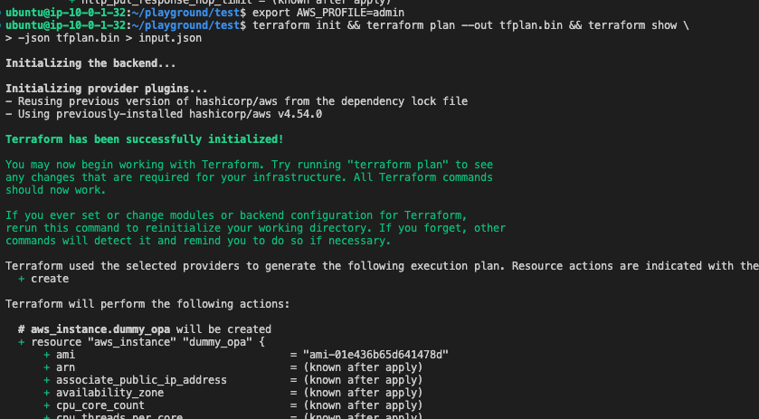
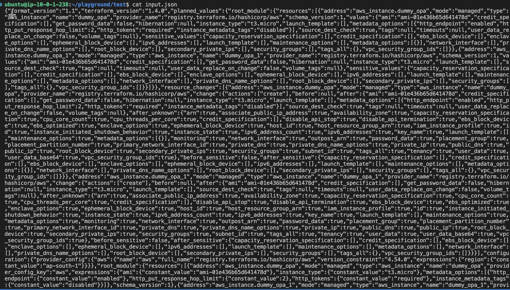
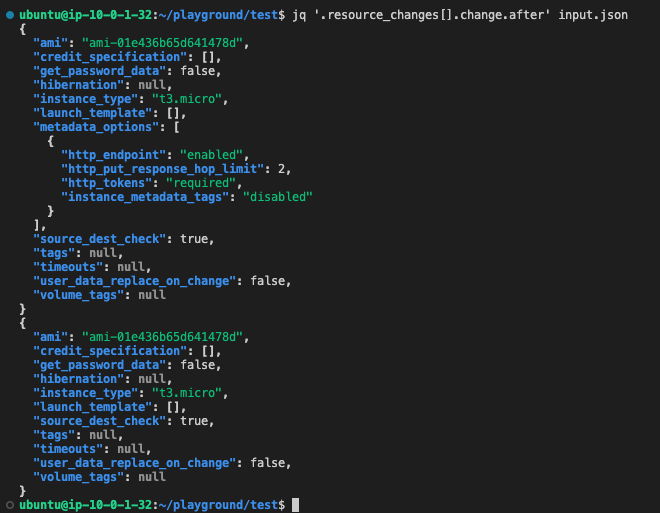

# Testing OPA

Let's try out OPA by getting some hands-on experience.

## 🛠️ Preparing Code

Let's prepare the code in order to to setup the environment for OPA

```bash
cd ~/playground/
cp -r ~/s4cpcode/chapter6/6B/. ~/playground/
cd test
export AWS_PROFILE=admin
```

:::tip Bigger is Better
For this session its best to have the CLI in a bigger screen so feel free to expand it as per your convenience.
:::

## 📜 Terraform JSON Output

The code above has setup a simple terraform file which can provision a simple EC2 instance. We are however not interested in provisioning the EC2 but exporting the plan for the EC2 in JSON format and that's exactly what we are going to achieve through the commands below

```bash
export AWS_PROFILE=admin
terraform init && terraform plan --out tfplan.bin && terraform show \
-json tfplan.bin > input.json
cat input.json
```



- `input.json` is the Terraform Plan in JSON format



## 👁️ Terraform Plan Through OPA

Let's now view the Terraform Plan through OPA using the commands below

```bash
opa run input.json
data
data[key]
data.configuration
data.resource_changes
data.resource_changes[_].change
data.resource_changes[_].change.after[_]
exit
```

## 👁️ Terraform Plan Through JQ

:::tip jq (Command-Line JSON Processor)

`jq` is a command-line tool for processing and manipulating JSON data. It enables selective extraction, filtering, modification, and transformation of JSON data. `jq` is widely used for parsing and working with JSON in Unix-like operating systems, making it a valuable tool for data manipulation and transformation.
:::

Since we are dealing with JSON let's view the terraform plan using `jq` as well.


```bash
jq '.resource_changes[].change.after' input.json
```



