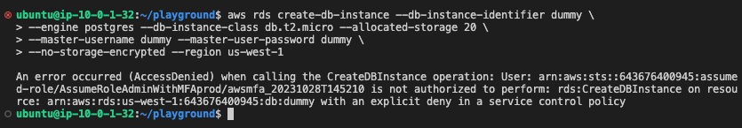

# Testing SCPs - Part One

Let's now test out each of the SCPs while at the same time also understand how the SCPs are implemented by viewing their specific code.

## ❌ Deny Creation of Users

- Deny creation of Users in all accounts except identity account

```toml
data "aws_iam_policy_document" "deny_user_creation_scp" {
  statement {
    sid       = "DenyCreatingIAMUsers"
    effect    = "Deny"
    resources = ["*"]

    actions = [
      "iam:CreateUser",
      "iam:CreateAccessKey",
    ]
  }
}
```

**Commands To Test**

> Please replace `<prod-account-id>`

```bash
awsmfa -i goku arn:aws:iam::<prod-account-id>:role/AssumeRoleAdminWithMFAprod
aws iam create-user --user-name dummy
```


## 🔐 EBS Blocks and RDS Storage must be encrypted

- Encrypting EBS Blocks and RDS Storage devices

```toml
data "aws_iam_policy_document" "ebs_rds_encryption_scp" {
  statement {
    sid       = "DenyUnEncryptedEBSVolumes"
    effect    = "Deny"
    resources = ["arn:aws:ec2:*:*:volume/*"]
    actions   = ["ec2:CreateVolume"]

    condition {
      test     = "Bool"
      variable = "ec2:Encrypted"
      values   = ["false"]
    }
  }

  statement {
    sid       = "DenyUnEncryptedRDS"
    effect    = "Deny"
    resources = ["*"]
    actions   = ["rds:CreateDBInstance"]

    condition {
      test     = "Bool"
      variable = "rds:StorageEncrypted"
      values   = ["false"]
    }
  }
}
```

**Commands To Test**

```bash
aws rds create-db-instance --db-instance-identifier dummy \
--engine postgres --db-instance-class db.t2.micro --allocated-storage 20 \
--master-username dummy --master-user-password dummy \
--no-storage-encrypted --region us-west-1
```



