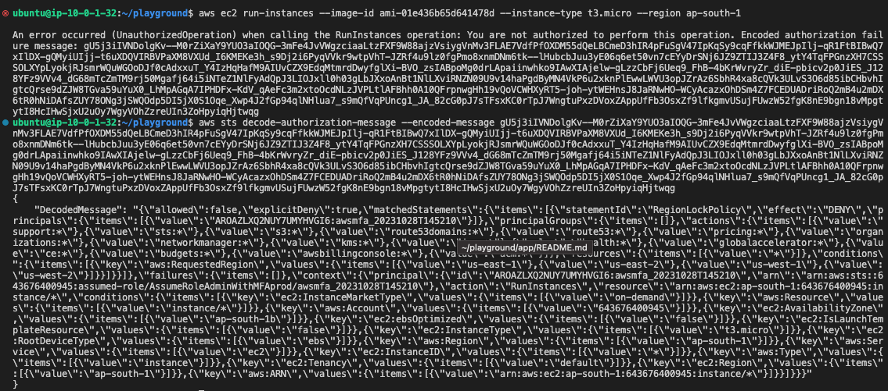
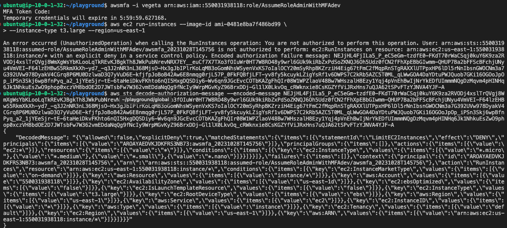

# 6.1.3 Testing SCPs - Part Two

[Youtube 📺](https://www.youtube.com/watch?v=Am9417a87zU&t=7387s)

## ❌ Restrict AWS Services and Regions

- Restrict AWS Services and Regions to specific values only

```toml
data "aws_iam_policy_document" "region_lock_scp" {
  statement {
    sid       = "RegionLockPolicy"
    effect    = "Deny"
    resources = ["*"]

    not_actions = [
      "acm:*",
      "awsbillingconsole:*",
      "budgets:*",
      "ce:*",
      "globalaccelerator:*",
      "health:*",
      "iam:*",
      "kms:*",
      "networkmanager:*",
      "organizations:*",
      "pricing:*",
      "route53:*",
      "route53domains:*",
      "sts:*",
      "support:*",
      "s3:*",
    ]

    condition {
      test     = "StringNotEquals"
      variable = "aws:RequestedRegion"

      values = [
        "us-east-1",
        "us-east-2",
        "us-west-1",
        "us-west-2",
      ]
    }
  }
}
```

**Commands To Test**

```bash
aws ec2 run-instances --image-id ami-01e436b65d641478d --instance-type t3.micro --region ap-south-1
aws sts decode-authorization-message --encoded-message
```



## ❌ Restrict EC2 and DB instance types for dev environment

- Restrict eC2 and RDS DB instance types in dev environment, donot allow large instance types to run in dev

```toml
data "aws_iam_policy_document" "instance_type_limit_scp" {
  statement {
    sid       = "LimitEC2Instances"
    effect    = "Deny"
    resources = ["*"]
    actions   = ["ec2:*"]

    condition {
      test     = "ForAnyValue:StringNotLike"
      variable = "ec2:InstanceType"

      values = [
        "*.micro",
        "*.medium",
        "*.small",
        "*.nano",
      ]
    }
  }

  statement {
    sid       = "LimitRDSInstances"
    effect    = "Deny"
    resources = ["*"]
    actions   = ["rds:*"]

    condition {
      test     = "ForAnyValue:StringNotLike"
      variable = "rds:DatabaseClass"

      values = [
        "*.micro",
        "*.small",
        "*.nano",
      ]
    }
  }
}
```

**Commands To Test**

> Please replace `<dev-account-id>`

```bash
awsmfa -i vegeta arn:aws:iam::<dev-account-id>:role/AssumeRoleAdminWithMFAdev
export AWS_PROFILE=default
aws ec2 run-instances --image-id ami-0481e8ba7f486bd99 --instance-type t3.large --region=us-east-1
aws sts decode-authorization-message --encoded-message
```

